# Project Specification: IP Tax Reporting Automation Tool

**Status:** Approved

---

## Table of Contents

1. [Executive Summary](#executive-summary)
2. [Project Overview](#project-overview)
3. [Core Requirements](#core-requirements)
4. [Architecture & Design](#architecture--design)
5. [Data Flow & State Management](#data-flow--state-management)
6. [Technical Specifications](#technical-specifications)
7. [Implementation Phases](#implementation-phases)
8. [Testing Strategy](#testing-strategy)
9. [Success Criteria](#success-criteria)
10. [Edge Cases & Considerations](#edge-cases--considerations)
11. [Appendices](#appendices)

---

## Executive Summary

**Tool Name:** `iptax`  
**Purpose:** Automate monthly IP tax report generation for Polish software developers participating in the IP tax deduction program (50% tax deduction for copyright income).

**Key Features:**
- Integrates with psss/did to automatically fetch merged PRs/MRs
- AI-assisted filtering of changes to match configured product
- Optional Workday integration for work hours retrieval
- Generates bilingual (Polish/English) PDF reports
- Maintains history to prevent duplicate reporting
- Interactive configuration and review workflow

**Primary Users:** Polish software developers working on open-source/FOSS projects for Red Hat or similar companies, who need to file monthly IP tax reports.

---

## Project Overview

### 1.1 Background

Polish tax law provides a 50% tax deduction for copyright income. Software developers contributing to FOSS projects can claim this deduction by submitting monthly reports documenting their creative work. This tool automates the tedious process of:

1. Collecting all merged code contributions from multiple repositories
2. Filtering contributions relevant to a specific product
3. Calculating creative work hours
4. Generating legally compliant bilingual reports

### 1.2 Problem Statement

Manual report generation involves:
- Running multiple CLI commands to extract PR/MR data
- Manually filtering changes to match product scope
- Calculating work hours from Workday or timesheets
- Creating formatted PDFs with bilingual text
- Tracking which changes were already reported to avoid duplicates

This process takes 2-4 hours monthly and is error-prone.

### 1.3 Solution Scope

The `iptax` tool will:
- ✅ Automate data collection from GitHub/GitLab via psss/did
- ✅ Use AI to filter changes matching the configured product
- ✅ Integrate with Workday to retrieve work hours (or accept manual input)
- ✅ Generate three output files: markdown report, work card PDF, tax report PDF
- ✅ Track history to prevent duplicate/missing changes between reports
- ✅ Provide interactive configuration and review workflows

The tool will NOT:
- ❌ Submit reports to tax authorities (manual submission required)
- ❌ Perform tax calculations beyond creative work hours
- ❌ Validate legal compliance (assumes user understands requirements)
- ❌ Modify or commit code changes on behalf of the user

---

## Core Requirements

### 2.1 Tool Name & Purpose

**CLI Command:** `iptax`

**Purpose:**  
Generate monthly IP tax reports for the Polish IP tax deduction program by:
1. Fetching merged code contributions from configured repositories
2. Filtering changes to match a specific product using AI assistance
3. Calculating creative work hours
4. Generating bilingual PDF reports with all required legal elements


### 2.2 Data Sources Integration

#### 2.2.1 psss/did Integration

**Repository:** https://github.com/psss/did  
**Version Required:** PR #311 (until merged into main)

**Purpose:** Fetch merged PRs/MRs from GitHub/GitLab instances.

**Integration Approach:**
- **Use did as a project dependency** (add to pyproject.toml)
- **Call did SDK directly** instead of shell-outs
- Avoid markdown parsing by using did's Python API directly

**Configuration Requirements:**
- User must have `~/.did/config` configured with GitHub/GitLab credentials
- Tool reads this config to determine which providers are enabled
- If no providers configured, guide user to configure did first

**Date Range Calculation:**
- **Start Date:** Last report's `last_cutoff_date` + 1 day (from history file)
- **End Date:** Current date when tool is executed
- For first report: prompt user for previous month cut-off date (default: 25th)

**Important Behavioral Rules:**
1. **Detect Existing Report:** Before generating, check if report for current month already exists
2. **User Confirmation:** If exists, ask user if they want to regenerate/continue
3. **No Config Cut-off:** Do NOT store cut-off day in config (removed based on feedback)

**Output Format:**
The did SDK will return structured data (not markdown), containing:
- List of changes (PRs/MRs) with descriptions, URLs, and metadata
- List of unique repositories

**Integration Points:**
- Import did SDK and call its Python API
- Extract PR/MR data directly from SDK response objects
- Handle both GitHub and GitLab data structures
- Detect when did SDK is not properly configured

**Error Handling:**
- `did` SDK not installed → install as dependency (no manual installation)
- `~/.did/config` missing → guide user to configure did
- No providers configured → guide user to add providers
- Authentication failures → show did error and suggest re-authentication

**Example SDK Usage (Conceptual):**
```python
from did import Did

# Initialize did with config
did_client = Did(config_path="~/.did/config")

# Fetch changes for date range
changes = did_client.fetch(
    since=start_date,
    until=end_date,
    merge_requests=True,
    pull_requests=True
)

# Extract data directly from SDK objects
for change in changes:
    print(f"{change.description} ({change.repo}#{change.number})")
```

#### 2.2.2 Workday Integration

**Purpose:** Automatically retrieve working days and hours for the reporting period.

**Approach:** Headless browser automation (Playwright recommended)

**Authentication:**
```yaml
workday:
  enabled: true
  url: "https://workday.company.com"
  auth: "saml"  # Only SAML supported for now
```

**SAML vs API Question:**
- **SAML Web Scraping:** Currently planned approach using Playwright
  - Reason: SAML authentication typically doesn't provide API tokens
  - Need to scrape webpages after SAML login
  
- **Workday API (Future Enhancement):**
  - If Workday API key becomes available, could use REST API instead
  - Would require separate authentication mechanism
  - For now: focus on SAML + web scraping

**Authentication Flow:**
1. Navigate to Workday URL (from config)
2. Handle SAML authentication via company Keycloak
3. Navigate to timesheet/absence calendar
4. Extract working days and absence for the reporting period
5. Calculate total working hours

**Data Needed:**
- Working days in the reporting period
- Absence days (vacation, sick leave)
- Total working hours (typically `working_days × 8`)

**Fallback Mode:**
If Workday integration is not configured or fails:
1. Prompt user: "Enter number of working days in [reporting period]:"
2. Prompt user: "Enter total working hours (or press Enter for [calculated default]):"
3. Calculate creative work hours based on configured percentage

**Security Considerations:**
- Never store passwords in config files
- Use system authentication (Kerberos/SAML)
- Browser session data stored only in memory, not persisted
- Clear session data after retrieval

**Error Handling:**
- Navigation timeout → fall back to manual input
- Authentication failure → fall back to manual input
- Element not found → fall back to manual input
- Network errors → fall back to manual input


#### 2.2.3 AI Provider Integration

**Purpose:** Automatically filter changes to match the configured product using AI judgment.

**Supported Providers:**
1. **GCP Vertex AI** (recommended for Red Hat users with GCP access)
2. **Google Gemini API** (recommended for personal use)

**Provider-Agnostic Wrapper:**
Use LiteLLM or LangChain to support multiple providers with a unified interface.

**Batch Filtering Workflow:**
```
1. Load judgment history/cache
2. Collect all changes from did
3. Build batch prompt with:
   - Product name
   - Judgment history (past AI decisions AND human overrides with reasoning)
   - All current changes with full details
4. Send single batch request to AI
5. AI judges all changes at once (not in a loop)
6. Parse AI response for all decisions
7. Display all changes with AI decisions in TUI
8. Quick review: "Accept all AI decisions? [y/n]"
9. If no → navigate through changes, override specific decisions
10. Save updated judgment cache
```

**AI Batch Prompt Template:**
```
Product: {product_name}

Previous Judgment History (for context and learning):
AI decisions and human overrides (with reasoning) are crucial for performance improvement.

Past Decisions:
- [description] (owner/repo#123)
  AI Decision: INCLUDE
  Human Decision: INCLUDE
  AI Reasoning: implements feature X
  
- [description] (owner/repo#456)
  AI Decision: INCLUDE
  Human Decision: EXCLUDE
  AI Reasoning: infrastructure change
  Human Reasoning: This is internal tooling, not product work (human override)

Current Changes to Judge:
1. owner/repo#789
   URL: https://github.com/owner/repo/pull/789
   Description: [full PR/MR description]
   
2. owner/repo#790
   URL: https://github.com/owner/repo/pull/790
   Description: [full PR/MR description]

Question: For each change above, determine if it's related to "{product_name}".

Respond in YAML format (token-efficient):
---
judgments:
  - change_id: owner/repo#789
    decision: INCLUDE  # or EXCLUDE or UNCERTAIN
    reasoning: brief explanation
    
  - change_id: owner/repo#790
    decision: EXCLUDE
    reasoning: brief explanation

Decision Rules:
- INCLUDE: change directly contributes to this product
- EXCLUDE: change is unrelated to this product  
- UNCERTAIN: cannot determine with confidence
- NOTE: Do NOT use ERROR - that's only for system errors
```

**Judgment Cache:**
Location: `~/.cache/iptax/ai_cache.json` (or `.toml` or `.yaml`)

**Cache Format (JSON example, but YAML/TOML also acceptable):**
```json
{
  "cache_version": "1.0",
  "judgments": {
    "owner/repo#123": {
      "url": "https://github.com/owner/repo/pull/123",
      "description": "Full PR description text here",
      "decision": "INCLUDE",
      "user_decision": "INCLUDE",
      "reasoning": "Implements serverless feature X",
      "user_reasoning": null,
      "product": "Red Hat OpenShift Serverless",
      "timestamp": "2024-11-01T10:30:00Z",
      "ai_provider": "gemini-1.5-pro"
    },
    "owner/repo#456": {
      "url": "https://github.com/owner/repo/pull/456",
      "description": "Full PR description text here",
      "decision": "INCLUDE",
      "user_decision": "EXCLUDE",
      "reasoning": "Infrastructure change, seems related",
      "user_reasoning": "This is internal tooling, not product work",
      "product": "Red Hat OpenShift Serverless",
      "timestamp": "2024-11-01T10:32:00Z",
      "ai_provider": "gemini-1.5-pro"
    }
  }
}
```

**Cache Schema Explanation:**
- `url`: Full PR/MR link (AI may not have access to internal GitLab instances)
- `description`: Full PR/MR description stored for AI context
- `decision`: AI's initial decision (INCLUDE/EXCLUDE/UNCERTAIN)
- `user_decision`: Final decision after user review (may differ from AI)
- `reasoning`: AI's explanation for the decision
- `user_reasoning`: Optional human explanation when overriding (helps AI learn)
- **Note:** No `user_override` field needed - compare `decision` vs `user_decision` to detect overrides
- **Note:** ERROR is NOT an AI decision - it's only set by the system when API calls fail

**Configuration:**
```yaml
ai:
  provider: "gemini"  # or "vertex"
  model: "gemini-1.5-pro"  # or "gemini-1.5-flash"
  api_key_env: "GEMINI_API_KEY"  # environment variable name
  
  # For Vertex AI:
  # project_id: "my-gcp-project"
  # location: "us-central1"
```

**Interactive Review Process:**
- **IMPORTANT:** This is the ONLY interactive review step
- User reviews AI decisions about which changes to INCLUDE/EXCLUDE
- User does NOT add or remove changes beyond what `did` provided
- User ONLY confirms or overrides AI's filtering decision for each change
- Changes list comes exclusively from the `did` SDK output

**Error Handling (System-Level):**
- API rate limits → mark affected changes with ERROR status, let user decide via TUI
- API errors → mark affected changes with ERROR status, let user decide via TUI
- Invalid API key → prompt user to configure provider before TUI
- Network errors → mark affected changes with ERROR status, let user decide via TUI
- AI unable to judge → AI returns UNCERTAIN, user decides via TUI
- **Note:** ERROR status is set by the system, not by AI


### 2.3 Configuration Management

#### 2.3.1 Settings File

**Location:** `~/.config/iptax/settings.yaml`

**Purpose:** Store user preferences and integration settings (excluding cut-off dates, which are tracked in history).

**Full Schema:**
```yaml
# Employee Information
employee:
  name: "Krzysztof Suszyński"
  supervisor: "Vaclav Tunka"

# Product Configuration
product:
  name: "Red Hat OpenShift Serverless"
  
# Report Generation Settings
report:
  output_dir: "~/Documents/iptax/{year}/"  # {year} will be replaced with YYYY
  creative_work_percentage: 80  # Percentage of work considered creative (0-100)
  
# AI Provider Configuration
ai:
  provider: "gemini"  # Options: "gemini", "vertex"
  model: "gemini-1.5-pro"
  api_key_env: "GEMINI_API_KEY"
  
  # Vertex AI specific (uncomment if using Vertex AI)
  # project_id: "my-gcp-project"
  # location: "us-central1"
  
# Work Hours Provider
workday:
  enabled: false  # Set to true to enable Workday integration
  url: ""  # Company Workday URL
  auth: "saml"  # Only SAML supported for now
  
# psss/did Configuration
did:
  config_path: "~/.did/config"  # Path to did config file
  providers:
    - "github.com"
    - "gitlab.cee"
    - "gitlab"
```

**Key Changes from Initial Requirements:**
- **NO cut_off_day in config** - dates are tracked in history file instead
- **NO cut_off_start_day in config** - prompted on first run only
- **Added providers list** - user selects which did providers to use

**Validation Rules:**
- `employee.name` and `employee.supervisor` must be non-empty strings
- `product.name` must be non-empty string
- `report.creative_work_percentage` must be between 0-100
- `report.output_dir` must be valid path with optional `{year}` placeholder
- `ai.provider` must be one of: "gemini", "vertex"
- If `workday.enabled = true`, `workday.url` must be valid URL
- `workday.auth` must be "saml" (only supported option)
- `did.config_path` must exist and be readable
- `did.providers` must be non-empty list of provider names from ~/.did/config

**Auto-Detection on First Run:**
1. Check if `~/.config/iptax/settings.yaml` exists
2. If not → run interactive questionnaire (`iptax config`)
3. Validate `~/.did/config` exists and has providers
4. Let user select which providers to use
5. Test AI provider connection (if configured)
6. Save valid configuration

**Update Workflow:**
User can run `iptax config` anytime to:
- Update any setting interactively
- Re-validate configuration
- Test integrations (did, AI, Workday)

#### 2.3.2 History File

**Location:** `~/.cache/iptax/history.toml`

**Purpose:** Track cut-off dates for each monthly report to prevent duplicate or missing changes.

**Critical Concept - Cut-off Date Tracking:**

The history file is the **single source of truth** for determining date ranges for each report. This prevents two critical issues:

1. **Duplicate Reporting:** Reporting the same change in multiple months
2. **Missing Changes:** Changes that fall between reports

**How It Works:**
- Each report entry stores the `last_cutoff_date` for that month
- Next report's start date = previous `last_cutoff_date` + 1 day
- Next report's end date = current date when tool is executed
- This creates a continuous timeline with no gaps or overlaps

**Simplified History Schema:**
```toml
["2024-10"]
last_cutoff_date = "2024-10-26"
generated_at = "2024-10-26T14:30:00Z"

["2024-11"]
last_cutoff_date = "2024-11-25"
generated_at = "2024-11-26T09:30:00Z"
regenerated_at = "2024-11-30T11:00:00Z"  # Optional: if regenerated
```

**History Fields:**
- `last_cutoff_date`: The end date used for this report (required for next report's start date)
- `generated_at`: When the report was first created
- `regenerated_at`: Optional, when the report was last regenerated

**Removed Fields (simplified):**
- ~~`total_changes`~~ - not needed in history
- ~~`included_changes`~~ - not needed in history
- ~~`excluded_changes`~~ - not needed in history
- ~~`working_days`~~ - not needed in history
- ~~`creative_hours`~~ - not needed in history
- ~~`report_files`~~ - can be derived from month + output_dir

**History Operations:**
1. **Read:** Load history to determine date range
2. **Write:** Save report metadata after successful generation
3. **Query:** Check if report for a month already exists
4. **Validate:** Ensure no gaps in timeline (warn if detected)

**Edge Cases:**
- **Gap in Timeline:** If user skips a month, warn but allow (they may not have worked that month)
- **Future Dates:** Prevent generating reports for future months
- **Past Regeneration:** Allow regenerating any past month with confirmation


### 2.4 Report Output

The tool generates three output files from a single source of truth (the filtered changes from did):

#### 2.4.1 Output Location

**Configurable Directory:**
```yaml
# In settings.yaml
report:
  output_dir: "~/Documents/iptax/{year}/"  # {year} will be replaced with YYYY
  creative_work_percentage: 80
```

**Default:** `~/Documents/iptax/YYYY/`
- `{year}` placeholder automatically replaced with report year
- Creates directory structure: `~/Documents/iptax/2024/`, `~/Documents/iptax/2025/`, etc.
- Tool automatically creates directories if they don't exist

**Example Directory Structure:**
```
~/Documents/iptax/
├── 2024/
│   ├── 2024-10 IP TAX Report.md
│   ├── 2024-10 IP TAX Work Card.pdf
│   ├── 2024-10 IP TAX Raport.pdf
│   ├── 2024-11 IP TAX Report.md
│   ├── 2024-11 IP TAX Work Card.pdf
│   └── 2024-11 IP TAX Raport.pdf
└── 2025/
    ├── 2025-01 IP TAX Report.md
    ├── 2025-01 IP TAX Work Card.pdf
    └── 2025-01 IP TAX Raport.pdf
```

**CLI Override:**
```bash
iptax report --output-dir /path/to/custom/location
```

#### 2.4.2 Text Processing Rules

**GitHub Emoji/Icon Removal:**
GitHub PR titles often contain emoji codes like `:bug:`, `:sparkles:`, `:rocket:` that don't render in PDFs.

**Processing Rule:**
- Remove all GitHub emoji codes (pattern: `:[a-z_]+:`) from PR/MR titles
- Apply to both markdown and PDF outputs
- Examples:
  - `:bug: Fix memory leak` → `Fix memory leak`
  - `:sparkles: Add new feature` → `Add new feature`
  - `:rocket: Deploy v2.0` → `Deploy v2.0`

**Implementation:**
```python
import re

def clean_pr_title(title: str) -> str:
    """Remove GitHub emoji codes from PR title."""
    # Remove :emoji_code: pattern
    cleaned = re.sub(r':\w+:', '', title)
    # Remove extra whitespace
    cleaned = ' '.join(cleaned.split())
    return cleaned.strip()
```

#### 2.4.3 Markdown Report

**Filename:** `YYYY-MM IP TAX Report.md`  
**Location:** `{output_dir}/YYYY-MM IP TAX Report.md`

**Format:**
```markdown

## Changes

* [Description (owner/repo#number)](https://url)
* [Description (owner/repo#number)](https://url)
* ...

## Projects

* [owner / repo](https://url)
* [owner / repo](https://url)
* ...
```

**Generation Rules:**
- Changes section: All included changes from AI filtering
- Projects section: Unique repositories extracted from changes
- Clean PR/MR titles: remove GitHub emoji codes (`:emoji:`)
- Preserve original description structure from did output
- Format: `* [description (owner/repo#number)](url)`
- Repository format: `* [owner / repo](url)`

#### 2.4.4 Work Card PDF

**Filename:** `YYYY-MM IP TAX Work Card.pdf`  
**Location:** `{output_dir}/YYYY-MM IP TAX Work Card.pdf`

**Purpose:** Document the creative work product (changes made during the period).

**Required Sections (Bilingual):**

1. **Header:**
   - Title: "Work Card / Karta Wykonanego Dzieła"
   - Work Card Number: `#1-YYYYMM`
   - Preparation Date: Document creation date (format: YYYY-MM-DD)

2. **Author Information:**
   - Author Name / Imię i nazwisko autora: [from config: employee.name]
   - Contributors / Współtwórcy: [extracted from Projects section repositories]

3. **Project List:**
   - Projects / Projekty: [list from Projects section, formatted]

4. **Work Description:**
   - Title / Tytuł: "[Product Name] changes for YYYYMM"
   - Value of Work / Wartość dzieła: [Changes list without URLs, with cleaned titles]
     ```
     * Description (owner/repo#number)
     * Description (owner/repo#number)
     ```
   - **Note:** Emoji codes must be removed before rendering to PDF

5. **Signatures:**
   - Author Signature / Podpis autora: _______________
   - Date / Data: _______________

**Bilingual Format:**
All labels must be in format: `Polish Label / English Label`

**Visual Layout:**
- A4 page size
- Professional formatting with clear sections
- Sans-serif font (e.g., Arial, Helvetica)
- Adequate spacing between sections
- Signature lines at bottom

#### 2.4.5 Tax Report PDF

**Filename:** `YYYY-MM IP TAX Raport.pdf`  
**Location:** `{output_dir}/YYYY-MM IP TAX Raport.pdf`

**Purpose:** Official monthly report for tax authorities documenting creative work hours and copyright transfer.

**Required Sections (Bilingual):**

1. **Header:**
   - Title: "Monthly IP Tax Report / Miesięczny Raport IP Tax"
   - Period / Okres: [Month name in Polish and English, e.g., "Październik 2024 / October 2024"]

2. **Employee Information:**
   - Employee Name / Imię i nazwisko pracownika: [from config: employee.name]
   - Supervisor Name / Przełożony: [from config: employee.supervisor]
   - Work Card Reference / Nr karty wykonanego dzieła: `#1-YYYYMM`

3. **Work Hours Calculation:**
   - Total Working Time / Całkowity czas pracy: "[H] working hours"
   - Creative Work Percentage / Procent pracy twórczej: [from config]%
   - Creative Work Hours / Godziny pracy twórczej: [calculated]
   
   **Calculation Formula:**
   ```
   creative_hours = total_hours × (creative_work_percentage / 100)
   ```
   
   **Example:**
   ```
   Total hours: 120
   Creative work percentage: 80%
   Creative hours: 120 × 0.8 = 96.0 hours
   ```

4. **Co-authors Section:**
   - Co-authors / Współautorzy: Reference to repositories
   - Format: "Contributors from: [list of unique repositories]"

5. **Product Context:**
   - Product / Produkt: [from config: product.name]
   - Statement: "All work was performed in the context of [Product Name] development and maintenance."

6. **Copyright Transfer Declaration:**
   - Bilingual legal text:
   ```
   Copyright Transfer / Transfer Praw Autorskich
   
   I hereby declare that all creative work documented in this report 
   was performed as part of my employment duties and all copyright 
   interests are transferred to the employer.
   
   Niniejszym oświadczam, że wszelkie prace twórcze udokumentowane 
   w tym raporcie zostały wykonane w ramach moich obowiązków służbowych 
   i wszystkie prawa autorskie zostały przeniesione na pracodawcę.
   ```

7. **Acceptance Section:**
   - Employee Acceptance / Akceptacja pracownika: ☐
   - Supervisor Acceptance / Akceptacja przełożonego: ☐
   - Date / Data: _______________

**Visual Layout:**
- A4 page size
- Professional formatting
- Clear section hierarchy
- Adequate spacing
- Signature and checkbox areas at bottom

#### 2.4.6 File Naming Convention

**Pattern:** `YYYY-MM IP TAX [Type].[ext]`

**Types:**
- `Report` - Markdown file
- `Work Card` - PDF file
- `Raport` - PDF file (note: "Raport" is Polish spelling)

**Examples:**
- `2024-10 IP TAX Report.md`
- `2024-10 IP TAX Work Card.pdf`
- `2024-10 IP TAX Raport.pdf`


### 2.5 Workflow Steps

The main `iptax report` command follows this workflow:

#### Step 1: Initialize & Validate

```
1.1 Load configuration from ~/.config/iptax/settings.yaml
    - If config doesn't exist → run interactive setup (iptax config)
    - Validate all required fields

1.2 Check if ~/.did/config exists
    - If missing → guide user to configure did first
    - Verify providers are configured

1.3 Load history from ~/.cache/iptax/history.toml
    - If file doesn't exist → this is the first report

1.4 Determine reporting month:
    - If --month specified → use that month (format: YYYY-MM)
    - Else → use current month (from current date)

1.5 Check if report for this month already exists in history:
    - If exists → warn user:
      ⚠ Report for [Month YYYY] already exists (generated on [date])
      
      Regenerate? This will:
      - Fetch changes up to current date
      - Overwrite existing files
      - Update history with new cutoff date
      
      Continue? [y/N]:
    - If user declines → exit
    - If user accepts → proceed with regeneration
```

#### Step 2: Calculate Date Range

```
2.1 Determine START date:
    - If history has previous month's report:
      start_date = previous_report.last_cutoff_date + 1 day
      
    - If NO previous report (first run):
      Prompt user: "Enter cutoff date for previous month (YYYY-MM-DD) [default: 25th of previous month]:"
      Example: For October 2024 report, default is 2024-09-25
      start_date = user_input + 1 day

2.2 Determine END date:
    - end_date = current date (when tool is executed)
    - Example: If running on 2024-11-15, end_date = 2024-11-15

2.3 Validate date range:
    - Calculate range in days: days = end_date - start_date
    - Calculate range in months: months = approximate month span
    
    - If range > 31 days (approximately 1 month):
      ⚠ WARNING: Date range spans more than one month
      
      Date range: [start_date] to [end_date] ([days] days)
      This appears to span multiple months.
      
      You can only report changes for ONE month at a time.
      Months can be skipped for various reasons (sick leave, vacation, etc.)
      
      Options:
      1. Adjust start date to limit to current month
      2. Enter custom cutoff date for previous month
      3. Continue anyway (not recommended)
      
      Choose [1/2/3]:
      
      If user chooses option 2:
        Prompt: "Enter cutoff date for previous month (YYYY-MM-DD) [default: 25th]:"
        Recalculate start_date = user_input + 1 day
        Validate new range
    
    - Ensure start_date <= end_date

2.4 Display date range to user:
    "Generating report for: [start_date] to [end_date] ([X] days)"
```

#### Step 3: Fetch Changes from did SDK

```
3.1 Initialize did SDK:
    from did import Did
    did_client = Did(config_path=settings.did.config_path)

3.2 Fetch changes using SDK (not shell-out):
    changes = did_client.fetch(
        since=start_date,
        until=end_date,
        merge_requests=True,
        pull_requests=True
    )

3.3 Handle errors:
    - did SDK not installed → should not happen (project dependency)
    - No providers configured → guide user to configure
    - Authentication failures → show error, suggest re-auth
    - Network errors → show error, retry or exit

3.4 Process changes:
    - Extract all changes with metadata (description, URL, repo, number)
    - Extract all unique repositories
    - Clean PR/MR titles: remove GitHub emoji codes (:emoji:)

3.5 Display summary:
    "✓ Found [N] changes across [M] repositories"
    
    If N == 0:
      "⚠ No changes found for this period."
      "This might happen if:"
      "  - You were on leave"
      "  - No PRs/MRs were merged"
      "  - Date range is incorrect"
      "  - did providers not configured correctly"
      
      "Continue with empty report? [y/N]:"
      - If no → exit
      - If yes → proceed with empty report
    
    If N > 0:
      NO confirmation needed - proceed automatically
```

#### Step 4: Get Work Hours

```
4.1 Check if Workday is enabled in config:
    - If workday.enabled == true → try automated retrieval
    - If workday.enabled == false → skip to manual input

4.2 If Workday enabled:
    4.2.1 Launch headless browser (Playwright)
          Show: "⏳ Connecting to Workday..."
    
    4.2.2 Navigate to workday.url
    4.2.3 Wait for SAML/Kerberos authentication
          Show: "🔐 Authenticating..."
    
    4.2.4 Navigate to timesheet/calendar
          Show: "📊 Fetching work hours..."
    
    4.2.5 Extract working hours for date range
          (Not days - actual hours, since users may work irregular hours)
    
    4.2.6 Close browser
    
    4.2.7 If successful:
          Show: "✓ Retrieved [H] hours from Workday"
          Proceed to Step 4.4
    
    4.2.8 If ANY step fails:
          Show error details:
          "❌ Workday integration failed"
          "Reason: [specific error message]"
          "  - Navigation timeout at [step]"
          "  - Authentication failed"
          "  - Element not found: [element]"
          "  - Network error: [error]"
          
          Options:
          1. [r]etry - Try Workday again
          2. [m]anual - Enter hours manually
          3. [e]xit - Abort report generation
          
          Choose [r/m/e]:
          
          - If retry → go back to 4.2.1
          - If manual → proceed to 4.3
          - If exit → exit with code 1

4.3 Manual hours input:
    4.3.1 Prompt for total working hours:
          "Enter total working hours for [start_date] to [end_date]:"
          "Example: 120 for 15 days × 8 hours"
          "Note: Enter actual hours worked (may be more or less than 8/day)"
          
          Hours: _
    
    4.3.2 Validate input:
          - Must be a number
          - Must be > 0
          - Must be reasonable (e.g., < 500 hours)
    
    4.3.3 Store total_hours = user_input

4.4 Calculate creative work hours:
    creative_hours = total_hours × (creative_work_percentage / 100)
    
    Example:
    - Total hours: 120
    - Creative percentage: 80%
    - Creative hours: 120 × 0.8 = 96.0 hours

4.5 Display summary:
    "Work hours summary:"
    "  Total hours: [H]"
    "  Creative percentage: [P]%"
    "  Creative hours: [CH]"
```


#### Step 5: AI-Assisted Filtering (TUI Review)

```
5.1 Check if --skip-ai flag is set:
    - If yes → skip AI, all changes marked as UNCERTAIN for manual review
    - If no → proceed with AI filtering

5.2 Initialize AI provider:
    - Load provider config from settings
    - Initialize LiteLLM/LangChain with provider
    - Handle API key from environment variable

5.3 Load judgment cache:
    - Read from ~/.cache/iptax/ai_cache.json (or .toml/.yaml)
    - Parse cached judgments

5.4 Build batch prompt:
    5.4.1 Collect past decisions from cache (for context):
          - Include AI decisions and human overrides
          - Include reasoning from both AI and humans
          
    5.4.2 Prepare current changes:
          - Full PR/MR descriptions
          - URLs (important for internal GitLab)
          - Repository context
    
    5.4.3 Format prompt in token-efficient format (YAML/TOML)

5.5 Send batch request to AI:
    - Call AI provider API with batch prompt
    - Request YAML response (token-efficient)
    - Handle rate limiting with exponential backoff
    - Timeout after 60 seconds

5.6 Parse AI response:
    - Extract decisions for each change (INCLUDE/EXCLUDE/UNCERTAIN)
    - Extract reasoning for each decision
    - Handle malformed responses gracefully

5.7 Handle errors:
    - API errors → mark affected changes as ERROR
    - Rate limits → retry with backoff, or mark as ERROR
    - Network errors → mark affected changes as ERROR
    - Parsing errors → mark affected changes as ERROR

5.8 Display compact list (minimal borders, no reasoning):
    
    Changes Review ([N] total)
    ────────────────────────────────────────────────────────────
    ✓ Fix memory leak in controller (knative/hack#436)
    ✓ Add support for Go 1.22 (knative/toolbox#040)
    ✗ Adding user to Ambassadors (cncf/people#1290)
    ✓ Implement new feature X (knative/serving#1234)
    ? Cannot determine relevance (internal/tool#567)
    ! API timeout (gitlab/project#890)
    ✓ Bug fix in operator (knative/operator#234)
    ✗ Infrastructure update (infra/tools#456)
    ✓ Performance optimization (knative/eventing#789)
    [... more changes ...]
    ────────────────────────────────────────────────────────────
    Summary: 6 INCLUDE, 2 EXCLUDE, 1 UNCERTAIN, 1 ERROR
    
    Legend: ✓=INCLUDE ✗=EXCLUDE ?=UNCERTAIN !=ERROR

5.9 Check if user can auto-accept:
    - Count UNCERTAIN and ERROR decisions
    - If count(UNCERTAIN + ERROR) == 0:
      "All changes decided by AI. Accept all? [Y/n]:"
      
      If yes → proceed to Step 6 (report generation)
      If no → launch detailed review (Step 5.10)
    
    - If count(UNCERTAIN + ERROR) > 0:
      "⚠ [N] changes need manual review (UNCERTAIN or ERROR)"
      "Press Enter to start review..."
      → automatically launch detailed review (Step 5.10)

5.10 Detailed TUI review (navigable list):
     
     5.10.1 List view (minimal UI, fit maximum items):
            
            Changes Review (navigate: ↑↓, select: Enter, done: d)
            ────────────────────────────────────────────────────
            > ✓ Fix memory leak (knative/hack#436)
              ✓ Add Go 1.22 support (knative/toolbox#040)
              ✗ Add user to Ambassadors (cncf/people#1290)
              ✓ Implement feature X (knative/serving#1234)
              ? Cannot determine (internal/tool#567)        ← needs review
              ! API timeout (gitlab/project#890)            ← needs review
              ✓ Bug fix in operator (knative/operator#234)
            ────────────────────────────────────────────────────
            [6/15] INCLUDE: 6, EXCLUDE: 2, UNCERTAIN: 1, ERROR: 1
            [↑↓] navigate [Enter] details [f] flip [d] done
     
     5.10.2 Navigation:
            - ↑↓ (arrow keys): Navigate up/down
            - Enter: View details for selected change
            - f: Flip decision (INCLUDE ↔ EXCLUDE) without entering
            - d: Mark as done (only if no UNCERTAIN/ERROR remain)
            - q: Quit (ask to save if changes made)
     
     5.10.3 Details view (when user presses Enter):
            
            ════════════════════════════════════════════════════
            Change Details [5/15]
            ════════════════════════════════════════════════════
            
            Title: Cannot determine relevance
            Repo: internal/tool#567
            URL: https://internal-gitlab.com/internal/tool/-/merge_requests/567
            
            Description:
            [Full PR/MR description here, may be multiple lines]
            
            ────────────────────────────────────────────────────
            AI Decision: UNCERTAIN
            AI Reasoning: Cannot access internal GitLab to determine
                         if this relates to the product
            
            Current Decision: UNCERTAIN ← needs your input
            ────────────────────────────────────────────────────
            
            [i]nclude [e]xclude [r]easoning [b]ack [n]ext [p]rev
            
            Command: _
     
     5.10.4 Details view commands:
            - i: Set decision to INCLUDE (and return to list)
            - e: Set decision to EXCLUDE (and return to list)
            - r: Add/edit reasoning for your decision
            - b: Back to list view (without changing)
            - n: Next change details
            - p: Previous change details
            - q: Quit to list view
     
     5.10.5 Adding reasoning (when user presses 'r'):
            
            ════════════════════════════════════════════════════
            Add Your Reasoning (optional, helps AI learn)
            ════════════════════════════════════════════════════
            
            Your reasoning:
            > This is internal tooling, not product work_
            
            [Enter] Save and return  [Esc] Cancel
            ════════════════════════════════════════════════════
     
     5.10.6 Done validation:
            When user presses 'd' (done):
            
            - Check if any UNCERTAIN or ERROR remain
            - If yes:
              "⚠ [N] changes still need review:"
              "  - Change #5: UNCERTAIN"
              "  - Change #6: ERROR"
              ""
              "Press Enter to continue reviewing..."
              → return to list view
            
            - If no (all decided):
              "✓ All changes reviewed"
              "  INCLUDE: [I]"
              "  EXCLUDE: [E]"
              "  User overrides: [O]"
              ""
              "Confirm and continue? [Y/n]:"
              
              If yes → save cache and proceed to Step 6
              If no → return to list view

5.11 Save updated cache:
     - Update cache with all decisions
     - Include user_decision (may differ from AI decision)
     - Include user_reasoning if provided
     - Save to ~/.cache/iptax/ai_cache.json

5.12 Display filtering summary:
     "✓ Review complete"
     "  Included: [I] changes"
     "  Excluded: [E] changes"
     "  User overrides: [O] changes"
```

#### Step 6: Generate Reports

```
6.1 Prepare output directory:
    - Resolve output_dir from config (replace {year} placeholder)
    - Create directory if it doesn't exist
    - Example: ~/Documents/iptax/2024/

6.2 Generate Markdown Report:
    6.2.1 Filter changes to only included ones
    6.2.2 Extract unique repositories from included changes
    6.2.3 Format Changes section:
          - Clean PR titles (remove emoji codes)
          - Format: "* [description (owner/repo#number)](url)"
    6.2.4 Format Projects section:
          - Unique repos only
          - Format: "* [owner / repo](url)"
    6.2.5 Write to: {output_dir}/YYYY-MM IP TAX Report.md

6.3 Generate Work Card PDF:
    6.3.1 Load bilingual template (HTML or direct PDF)
    6.3.2 Fill in fields:
          - Work card number: #1-YYYYMM
          - Preparation date: current date (YYYY-MM-DD)
          - Author name: from config
          - Contributors: extracted from repositories
          - Project list: from Projects section
          - Title: "[Product Name] changes for YYYYMM"
          - Value of work: Changes list WITHOUT URLs
            (cleaned titles, no emoji)
    6.3.3 Render PDF using WeasyPrint
    6.3.4 Write to: {output_dir}/YYYY-MM IP TAX Work Card.pdf

6.4 Generate Tax Report PDF:
    6.4.1 Load bilingual template
    6.4.2 Fill in fields:
          - Period: Month name (bilingual)
            Example: "Październik 2024 / October 2024"
          - Employee name: from config
          - Supervisor name: from config
          - Work card reference: #1-YYYYMM
          - Working hours: from Step 4
          - Creative hours: calculated in Step 4
          - Co-authors: from Projects section
          - Product: from config
    6.4.3 Add legal text (copyright transfer, declarations)
    6.4.4 Render PDF using WeasyPrint
    6.4.5 Write to: {output_dir}/YYYY-MM IP TAX Raport.pdf

6.5 Display success message:
    "✓ Generated 3 report files:"
    "  📄 YYYY-MM IP TAX Report.md"
    "  📋 YYYY-MM IP TAX Work Card.pdf"
    "  📊 YYYY-MM IP TAX Raport.pdf"
    "  Location: {output_dir}"
```

#### Step 7: Update History

```
7.1 Create history entry for this month:
    month_key = "YYYY-MM"
    
    entry = {
        "last_cutoff_date": end_date (from Step 2),
        "generated_at": current_timestamp
    }
    
    If regenerating existing report:
        entry["regenerated_at"] = current_timestamp

7.2 Write to ~/.cache/iptax/history.toml:
    ["YYYY-MM"]
    last_cutoff_date = "YYYY-MM-DD"
    generated_at = "YYYY-MM-DDTHH:MM:SSZ"
    regenerated_at = "YYYY-MM-DDTHH:MM:SSZ"  # if applicable

7.3 Display completion message:
    "✓ Report history updated"
    "  Cutoff date: [end_date]"
    "  Next report will start from: [end_date + 1]"

7.4 Final summary:
    "━━━━━━━━━━━━━━━━━━━━━━━━━━━━━━━━━━━━━━"
    "Report Generation Complete ✓"
    "━━━━━━━━━━━━━━━━━━━━━━━━━━━━━━━━━━━━━━"
    
    "Period: [start_date] to [end_date]"
    "Changes: [N] included, [M] excluded"
    "Work hours: [H] ([CH] creative)"
    "Location: {output_dir}"
    
    "Next steps:"
    "  1. Review the generated PDFs"
    "  2. Submit reports to tax authorities"
    "  3. Run 'iptax' again next month"
```

#### Error Handling Throughout Workflow

**General Principles:**
- Always validate user input
- Provide clear error messages with suggested solutions
- Allow graceful fallbacks (e.g., Workday → manual input)
- Never lose user data (cache decisions immediately)
- Log errors for debugging

**Specific Error Scenarios:**

1. **Missing Configuration:**
   - Error: "Configuration file not found"
   - Solution: "Run 'iptax config' to set up"
   - Action: Exit with code 1

2. **did Not Configured:**
   - Error: "~/.did/config not found or has no providers"
   - Solution: "Configure did first: https://github.com/psss/did#setup"
   - Action: Exit with code 1

3. **AI API Errors:**
   - Error: Show specific API error
   - Solution: "Mark changes as ERROR, require manual review"
   - Action: Continue with manual review (cannot auto-accept)

4. **PDF Generation Failures:**
   - Error: Show template or rendering error
   - Solution: "Check template files and fonts"
   - Action: Exit with code 1 (reports incomplete)

5. **File Write Errors:**
   - Error: "Cannot write to {output_dir}"
   - Solution: "Check directory permissions"
   - Action: Exit with code 1

6. **Network Errors:**
   - Error: "Cannot connect to [service]"
   - Solution: "Check network connection and retry"
   - Action: Fallback or exit based on service

7. **Workday Failures:**
   - Error: Show specific failure reason
   - Options: retry/manual/exit
   - Action: User chooses next step


### 2.6 CLI Interface Design

#### 2.6.1 Command Structure

```
iptax [COMMAND] [OPTIONS]
```

**Available Commands:**
- `(no command)` - Default, equivalent to `iptax report` for current month
- `report` - Generate IP tax report
- `config` - Configure settings interactively
- `history` - Show report history
- `--help` - Show help message
- `--version` - Show version and exit

#### 2.6.2 Report Command

**Usage:**
```bash
iptax report [OPTIONS]
iptax [OPTIONS]  # same as above
```

**Options:**
```
--month YYYY-MM          Generate report for specific month (default: current)
--skip-ai                Skip AI filtering, manually review all changes
--skip-workday           Skip Workday integration, use manual hours input
--dry-run                Show what would be generated without creating files
--force                  Overwrite existing report without confirmation
--output-dir PATH        Custom output directory (overrides config)
--verbose, -v            Verbose output (show API calls, debug info)
--quiet, -q              Minimal output (errors only)
```

**Examples:**

```bash
# Generate report for current month (most common use case)
iptax

# Generate report for specific month
iptax report --month 2024-10

# Generate without AI filtering
iptax report --skip-ai

# Generate with manual hours input
iptax report --skip-workday

# Preview without creating files
iptax report --dry-run

# Force regenerate existing report
iptax report --month 2024-10 --force

# Custom output directory
iptax report --output-dir ~/my-reports/

# Verbose mode for debugging
iptax report --verbose

# Combination of options
iptax report --month 2024-10 --skip-ai --skip-workday --force
```

#### 2.6.3 Config Command

**Usage:**
```bash
iptax config [OPTIONS]
```

**Options:**
```
--validate               Validate current configuration
--show                   Display current configuration
--edit FIELD             Edit specific field interactively
```

**Examples:**

```bash
# Interactive setup (first time or full reconfiguration)
iptax config

# Validate current settings
iptax config --validate

# Show current configuration
iptax config --show

# Edit specific field
iptax config --edit employee.name
iptax config --edit ai.provider
```

**Interactive Questionnaire Flow:**
```
Welcome to iptax configuration!

Employee Information:
  Employee name: [current or empty]
  > Krzysztof Suszyński

  Supervisor name: [current or empty]
  > Vaclav Tunka

Product Configuration:
  Product name: [current or empty]
  > Red Hat OpenShift Serverless

Report Settings:
  Creative work percentage (0-100) [80]:
  > 80

  Output directory [~/Documents/iptax/{year}/]:
  > (press Enter for default)

AI Provider:
  Provider (gemini/vertex) [gemini]:
  > gemini

  Model [gemini-1.5-pro]:
  > (press Enter for default)

  API key environment variable [GEMINI_API_KEY]:
  > (press Enter for default)

Workday Integration:
  Enable Workday integration? [y/N]:
  > n

  (if yes)
  Workday URL:
  > https://workday.company.com

psss/did Configuration:
  did config path [~/.did/config]:
  > (press Enter for default)

  Reading ~/.did/config...
  Found providers:
    [1] github.com (enabled)
    [2] gitlab.cee (enabled)
    [3] gitlab (enabled)
    [4] gitlab.mw (disabled)
    [5] gitlab.corp (disabled)

  Select providers to use (comma-separated numbers or 'all') [all]:
  > 1,2,3

  Selected providers:
    ✓ github.com
    ✓ gitlab.cee
    ✓ gitlab

Testing configuration...
  ✓ did config found with 3 selected providers
  ✓ AI provider connection successful
  (✓ Workday connection successful - if enabled)

Configuration saved to ~/.config/iptax/settings.yaml
```

**Settings.yaml with Provider Selection:**
```yaml
did:
  config_path: "~/.did/config"
  providers:
    - "github.com"
    - "gitlab.cee"
    - "gitlab"
```

#### 2.6.4 History Command

**Usage:**
```bash
iptax history [OPTIONS]
```

**Options:**
```
--month YYYY-MM          Show specific month only
--format FORMAT          Output format: table, json, yaml (default: table)
```

**Examples:**

```bash
# Show all report history
iptax history

# Show specific month
iptax history --month 2024-10

# Output as JSON
iptax history --format json
```

**Example Output (Table Format):**
```
Report History
━━━━━━━━━━━━━━━━━━━━━━━━━━━━━━━━━━━━━━━━━━━━━━━━━━━
Month      Cutoff Date  Generated At         Regenerated
━━━━━━━━━━━━━━━━━━━━━━━━━━━━━━━━━━━━━━━━━━━━━━━━━━━
2024-09    2024-09-25   2024-09-26 10:30:00  -
2024-10    2024-10-26   2024-10-26 14:15:00  -
2024-11    2024-11-15   2024-11-15 09:00:00  2024-11-25
━━━━━━━━━━━━━━━━━━━━━━━━━━━━━━━━━━━━━━━━━━━━━━━━━━━

Next report will start from: 2024-11-16
```

## Architecture & Design

### 3.1 Technical Architecture

#### 3.1.1 Technology Stack

**Language:** Python 3.11+

**Rationale:**
- Native integration with psss/did (Python project)
- Rich ecosystem for CLI, PDF generation, browser automation, AI providers
- Excellent type hints support for maintainability
- Cross-platform compatibility

#### 3.1.2 Core Dependencies

```toml
# pyproject.toml

[project]
name = "iptax-reporter"
version = "0.1.0"
description = "Polish IP tax report automation tool"
requires-python = ">=3.11"

dependencies = [
    # CLI Framework
    "click>=8.1.0",              # CLI framework (mature, well-documented)
    "rich>=13.0.0",              # Terminal UI, colored output, TUI components
    
    # Configuration & Data
    "pyyaml>=6.0",               # YAML parsing for settings
    "pydantic>=2.0.0",           # Data validation and settings management
    
    # AI Provider
    "litellm>=1.0.0",            # AI provider abstraction (Gemini, Vertex AI, etc.)
    
    # Browser Automation
    "playwright>=1.40.0",        # Workday integration (modern, async)
    
    # PDF Generation
    "weasyprint>=60.0",          # PDF from HTML (pure Python, CSS support)
    "jinja2>=3.1.0",             # HTML template rendering
    
    # Date/Time
    "python-dateutil>=2.8.0",    # Date calculations
    
    # HTTP Client
    "httpx>=0.25.0",             # Modern HTTP client (async support)
    
    # psss/did Integration
    "did @ git+https://github.com/psss/did.git@main#egg=did",  # Until PR #311 merged
]

[project.optional-dependencies]
dev = [
    "pytest>=7.4.0",
    "pytest-asyncio>=0.21.0",
    "pytest-mock>=3.12.0",
    "pytest-cov>=4.1.0",
    "mypy>=1.7.0",
    "ruff>=0.1.0",              # Fast Python linter
    "black>=23.0.0",            # Code formatter
]

[project.scripts]
iptax = "iptax.cli:main"
```

#### 3.1.3 Project Structure

```
iptax-reporter/
├── src/
│   └── iptax/
│       ├── __init__.py
│       ├── cli.py              # CLI entry point, Click commands
│       ├── config.py           # Configuration management, validation
│       ├── history.py          # History tracking, date range calculation
│       ├── did_integration.py  # psss/did SDK wrapper
│       ├── workday.py          # Workday client (Playwright automation)
│       ├── ai_filter.py        # AI filtering logic, cache management
│       ├── report_compiler.py  # Report data compilation
│       ├── pdf_generator.py    # PDF generation (WeasyPrint)
│       ├── tui.py              # TUI components for review
│       ├── models.py           # Pydantic data models
│       ├── exceptions.py       # Custom exceptions
│       └── templates/
│           ├── work_card.html      # Work Card PDF template
│           ├── tax_report.html     # Tax Report PDF template
│           └── styles.css          # Shared PDF styles
├── tests/
│   ├── unit/
│   │   ├── test_config.py
│   │   ├── test_history.py
│   │   ├── test_did_integration.py
│   │   ├── test_ai_filter.py
│   │   ├── test_report_compiler.py
│   │   └── test_pdf_generator.py
│   ├── e2e/
│   │   ├── test_full_workflow.py
│   │   └── test_config_wizard.py
│   └── fixtures/
│       ├── sample_did_output.py
│       ├── sample_config.yaml
│       └── sample_history.toml
├── docs/
│   ├── installation.md
│   ├── configuration.md
│   ├── usage.md
│   ├── troubleshooting.md
│   └── project.md              # This file
├── pyproject.toml
├── README.md
├── LICENSE
└── .gitignore
```

#### 3.1.4 Key Design Decisions

**1. Click vs Typer for CLI**
- **Choice:** Click
- **Rationale:** Mature, stable, excellent documentation, better pytest integration
- **Alternative:** Typer (newer, type-hint based, but less mature ecosystem)

**2. WeasyPrint vs ReportLab for PDFs**
- **Choice:** WeasyPrint
- **Rationale:** 
  - Pure Python (no external dependencies)
  - Excellent CSS support for layout
  - Can render HTML templates directly
  - Good Unicode/Polish character support
- **Alternative:** ReportLab (more control but harder complex layouts)

**3. Playwright vs Selenium for Browser Automation**
- **Choice:** Playwright
- **Rationale:**
  - Modern, actively maintained
  - Better async support
  - Handles SAML/Kerberos flows well
  - Faster and more reliable
- **Alternative:** Selenium (older, less ergonomic API)

**4. LiteLLM vs LangChain for AI Provider**
- **Choice:** LiteLLM
- **Rationale:**
  - Simple, focused on provider abstraction
  - Lightweight, no unnecessary features
  - Easy to switch providers
  - Good error handling
- **Alternative:** LangChain (more features than needed, heavier)

**5. Rich vs Textual for TUI**
- **Choice:** Rich
- **Rationale:**
  - Simpler API for our needs
  - Excellent terminal rendering
  - Progress bars, tables, panels
  - Can build lightweight TUI
- **Alternative:** Textual (full TUI framework, more complex than needed)

---

**Note:** This document is a living specification that will be updated as the project evolves. Remaining sections (Testing Strategy, Implementation Phases, Success Criteria, Edge Cases) to be added.


## Testing Strategy

### 4.1 Testing Approach

**Overall Philosophy:**
- Test-driven development where appropriate
- Focus on critical path and error handling
- Mock external dependencies (AI, Workday, did)
- Use fixtures for sample data
- Make-based orchestration with guard files for idempotent builds

### 4.2 Make-Based Test Orchestration

**Primary Test Targets:**
```makefile
# Makefile

.PHONY: help
help:  ## Show this help
	@grep -E '^[a-zA-Z_-]+:.*?## .*$$' $(MAKEFILE_LIST) | sort | awk 'BEGIN {FS = ":.*?## "}; {printf "\033[36m%-20s\033[0m %s\n", $$1, $$2}'

# Guard files directory
GUARDS := .make

# Source tracking
SRC_FILES := $(shell find src -type f -name '*.py')
TEST_FILES := $(shell find tests -type f -name '*.py')

##@ Installation

.PHONY: install
install: $(GUARDS)/install.done  ## Install dependencies (idempotent)

$(GUARDS)/install.done: pyproject.toml
	@mkdir -p $(GUARDS)
	pip install -e ".[dev]"
	playwright install
	@touch $@

##@ Testing

.PHONY: test
test: unit e2e  ## Run all tests

.PHONY: unit
unit: $(GUARDS)/unit.passed  ## Run unit tests

$(GUARDS)/unit.passed: $(GUARDS)/install.done $(SRC_FILES) $(TEST_FILES)
	@mkdir -p $(GUARDS)
	pytest tests/unit/ -v
	@touch $@

.PHONY: e2e
e2e: $(GUARDS)/e2e.passed  ## Run end-to-end tests

$(GUARDS)/e2e.passed: $(GUARDS)/install.done $(GUARDS)/unit.passed $(SRC_FILES) $(TEST_FILES)
	@mkdir -p $(GUARDS)
	pytest tests/e2e/ -v
	@touch $@

.PHONY: test-watch
test-watch: $(GUARDS)/install.done  ## Run tests in watch mode
	pytest-watch

##@ Code Quality

.PHONY: lint
lint: $(GUARDS)/lint.passed  ## Run linter (idempotent)

$(GUARDS)/lint.passed: $(GUARDS)/install.done $(SRC_FILES)
	@mkdir -p $(GUARDS)
	ruff check src/ tests/
	@touch $@

.PHONY: format
format: $(GUARDS)/format.done  ## Format code (idempotent)

$(GUARDS)/format.done: $(GUARDS)/install.done $(SRC_FILES) $(TEST_FILES)
	@mkdir -p $(GUARDS)
	black src/ tests/
	ruff check --fix src/ tests/
	@touch $@

.PHONY: typecheck
typecheck: $(GUARDS)/typecheck.passed  ## Run type checker

$(GUARDS)/typecheck.passed: $(GUARDS)/install.done $(SRC_FILES)
	@mkdir -p $(GUARDS)
	mypy src/
	@touch $@

##@ Verification

.PHONY: verify
verify: $(GUARDS)/lint.passed $(GUARDS)/format.done test  ## Run full verification (lint + format + tests)
	@echo "✓ All verifications passed"

##@ Development

.PHONY: clean
clean:  ## Clean build artifacts and caches
	rm -rf $(GUARDS)/
	rm -rf .pytest_cache/
	rm -rf htmlcov/
	rm -rf .coverage
	rm -rf dist/
	rm -rf build/
	rm -rf *.egg-info/
	find . -type d -name __pycache__ -exec rm -rf {} +
	find . -type f -name '*.pyc' -delete

.PHONY: coverage
coverage: $(GUARDS)/install.done  ## Run tests with coverage report
	pytest --cov=iptax --cov-report=html --cov-report=term
	@echo "Coverage report: htmlcov/index.html"
```

**Dependency Graph:**
```
verify
├── lint → install
├── format → install
└── test
    ├── unit → install
    └── e2e → install + unit
```

**Key Features:**
- **Idempotent Operations:** All major targets use guard files
- **Proper Dependencies:** All test/lint/format targets depend on install
- **Verify Target:** Single command for full validation
- **Clean Invalidation:** Removes all guard files for fresh runs
- **Standard Make:** Uses conventional dependency tracking

### 4.3 Unit Tests

**Scope:** Test individual components in isolation

**Key Areas to Test:**

1. **Configuration Management (`test_config.py`):**
   - Settings loading and validation
   - Provider selection parsing
   - Config file creation
   - Validation error handling
   - Default value handling

2. **History Tracking (`test_history.py`):**
   - Date range calculation
   - History file creation and updates
   - Cutoff date tracking
   - Gap detection
   - Regeneration scenarios

3. **did Integration (`test_did_integration.py`):**
   - SDK initialization
   - Change extraction
   - Repository parsing
   - Error handling for auth failures
   - Provider filtering

4. **AI Filtering (`test_ai_filter.py`):**
   - Batch prompt generation
   - Response parsing (YAML/TOML)
   - Judgment cache operations
   - Decision logic (INCLUDE/EXCLUDE/UNCERTAIN/ERROR)
   - User override handling

5. **Report Compiler (`test_report_compiler.py`):**
   - Markdown formatting
   - Emoji removal
   - Project extraction
   - Data aggregation

6. **PDF Generator (`test_pdf_generator.py`):**
   - Template rendering
   - Bilingual text handling
   - PDF creation
   - File output

**Example Test Cases:**

```python
# test_history.py
def test_first_report_prompts_for_cutoff():
    """First report should prompt for previous month cutoff."""
    history = HistoryManager()
    assert not history.has_previous_report()

def test_subsequent_report_uses_previous_cutoff():
    """Second report should use previous cutoff + 1 day."""
    history = HistoryManager()
    history.add_entry("2024-10", date(2024, 10, 25))
    start_date, _ = history.get_date_range("2024-11")
    assert start_date == date(2024, 10, 26)

# test_ai_filter.py
def test_cached_judgment_reused():
    """Cached judgments should be reused."""
    cache = {"owner/repo#123": {"decision": "INCLUDE"}}
    filter = AIFilter(cache=cache)
    decision = filter.judge_change("owner/repo#123", ...)
    assert decision == "INCLUDE"
    assert filter.api_calls == 0
```

### 4.4 End-to-End Tests

**Critical Paths:**

1. **First-Time Setup:**
   - No config exists → interactive setup → report generation
   - Validates: config created, reports generated, history updated

2. **Regular Monthly Report:**
   - Config exists → fetch changes → AI filter → generate reports
   - Validates: correct date range, reports created, history updated

3. **Regeneration Flow:**
   - Report exists → confirm regeneration → overwrite files
   - Validates: files updated, history regenerated_at set

### 4.5 Test Fixtures

```
tests/fixtures/
├── sample_did_output.py       # Mock did SDK responses
├── sample_config.yaml          # Valid configuration
├── sample_history.toml         # History with multiple months
└── sample_ai_cache.json        # Pre-filled AI judgment cache
```

### 4.6 Test Execution

**Using Make (Recommended):**
```bash
# Full verification (what CI runs)
make verify

# Install dependencies
make install

# Run only unit tests
make unit

# Run only e2e tests
make e2e

# Run linter
make lint

# Format code
make format

# With coverage report
make coverage

# Clean and verify fresh
make clean verify
```

**Guard File Behavior:**
```bash
# First run - executes
$ make unit
pytest tests/unit/ -v
touch .make/unit.passed

# Second run (no changes) - skips
$ make unit
make: '.make/unit.passed' is up to date.

# After code change - re-executes
$ touch src/iptax/config.py
$ make unit
pytest tests/unit/ -v
touch .make/unit.passed
```


## Implementation Phases

### 5.1 Phase Overview

The project will be implemented in 4 phases, each delivering incremental value and building on the previous phase.

### 5.2 Phase 1: Foundation & Core Infrastructure (Week 1-2)

**Goal:** Establish project structure, configuration system, and basic CLI

**Deliverables:**
1. Project structure setup (src/, tests/, docs/)
2. Configuration management (settings.yaml loading, validation)
3. History tracking (history.toml operations)
4. Basic CLI framework (Click commands, help system)
5. Unit tests for config and history

**Success Criteria:**
- `iptax config` creates and validates settings
- `iptax history` displays (empty) history
- `make unit` passes all config/history tests
- Documentation in place

**Key Files:**
- `src/iptax/cli.py` - CLI entry point
- `src/iptax/config.py` - Settings management
- `src/iptax/history.py` - History operations
- `src/iptax/models.py` - Data models
- `Makefile` - Build orchestration
- `pyproject.toml` - Dependencies

### 5.3 Phase 2: Data Collection & Integration (Week 3-4)

**Goal:** Integrate with did SDK and implement change fetching

**Deliverables:**
1. did SDK integration
2. Change extraction and parsing
3. Date range calculation logic
4. Provider selection from ~/.did/config
5. Emoji cleaning from PR titles
6. Unit and integration tests

**Success Criteria:**
- Can fetch changes from configured did providers
- Date range calculated correctly from history
- Changes properly extracted with metadata
- Multi-month span detection works
- `make unit` passes all did integration tests

**Key Files:**
- `src/iptax/did_integration.py` - did SDK wrapper
- `tests/unit/test_did_integration.py` - Tests
- `tests/fixtures/sample_did_output.py` - Mock data

### 5.4 Phase 3: AI Filtering & Review (Week 5-6)

**Goal:** Implement AI-assisted filtering with TUI review

**Deliverables:**
1. AI provider integration (LiteLLM)
2. Batch judgment processing
3. Judgment cache system
4. TUI-based review interface (Rich)
5. User override and reasoning
6. Comprehensive tests with mocked AI

**Success Criteria:**
- AI batch filtering works for multiple providers
- Cache correctly stores and retrieves judgments
- TUI displays compact list and detail views
- User can navigate and override decisions
- UNCERTAIN/ERROR changes force manual review
- `make unit` and `make e2e` pass

**Key Files:**
- `src/iptax/ai_filter.py` - AI filtering logic
- `src/iptax/tui.py` - TUI components
- `tests/unit/test_ai_filter.py` - Tests
- `tests/fixtures/sample_ai_cache.json` - Mock cache

### 5.5 Phase 4: Report Generation & Polish (Week 7-8)

**Goal:** Complete report generation and finalize all features

**Deliverables:**
1. Workday integration (Playwright) with fallback
2. Report compiler (markdown formatting)
3. PDF generation (WeasyPrint, bilingual templates)
4. Work hours calculation
5. Complete e2e tests
6. Documentation (installation, usage, troubleshooting)

**Success Criteria:**
- Can generate all 3 output files (MD + 2 PDFs)
- PDFs are bilingual and properly formatted
- Workday integration works or falls back gracefully
- History updated correctly after generation
- `make verify` passes completely
- User documentation complete

**Key Files:**
- `src/iptax/workday.py` - Workday client
- `src/iptax/report_compiler.py` - Report compilation
- `src/iptax/pdf_generator.py` - PDF generation
- `src/iptax/templates/` - HTML templates
- `tests/e2e/test_full_workflow.py` - E2E tests
- `docs/installation.md` - User docs
- `docs/usage.md` - User docs

### 5.6 Timeline & Milestones

```
Week 1-2: Phase 1 - Foundation
├── M1.1: Project setup complete
├── M1.2: Config system working
└── M1.3: Basic CLI functional

Week 3-4: Phase 2 - Data Collection
├── M2.1: did integration working
├── M2.2: Change extraction complete
└── M2.3: Date range logic validated

Week 5-6: Phase 3 - AI & Review
├── M3.1: AI filtering operational
├── M3.2: TUI review working
└── M3.3: Cache system functional

Week 7-8: Phase 4 - Reports & Polish
├── M4.1: All reports generating
├── M4.2: Workday integration done
├── M4.3: Documentation complete
└── M4.4: Ready for release
```

### 5.7 Development Workflow

**Complete Feature/Bugfix Development Cycle:**

```bash
# 1. Start with clean state
make clean

# 2. Install dependencies
make install

# 3. Develop feature/bugfix
# ... make code changes ...

# 4. Format code
make format

# 5. Run relevant tests
make unit  # or make e2e

# 6. Full verification before committing
make verify

# 7. Create feature/bugfix branch
git checkout -b feature/your-feature-name
# or
git checkout -b fix/your-bugfix-name

# 8. Stage and commit changes (only modified files)
git add src/iptax/your_file.py tests/unit/test_your_file.py
git commit -m "feat: add batch AI filtering with YAML responses"

# Commit message format:
# - feat: new feature
# - fix: bug fix
# - docs: documentation changes
# - test: test additions/changes
# - refactor: code refactoring

# 9. Push to remote
git push origin feature/your-feature-name

# 10. Create pull request using GitHub CLI
gh pr create --title "Add batch AI filtering" \
             --body "Implements batch filtering with YAML responses and TUI review"

# Or use interactive mode:
gh pr create

# 11. Monitor CI checks
gh pr checks --watch

# Wait until all checks pass:
# ✓ Linting passed
# ✓ Tests passed
# ✓ Build successful

# 12. Get review comments
gh pr view

# 13. If corrections needed, make changes
# ... edit files ...
make verify
git add .
git commit -m "address review comments: improve error handling"
git push

# Re-check
gh pr checks --watch

# 14. Merge when approved and all checks pass
gh pr merge

# Choose merge strategy:
# - Squash and merge (recommended for features)
# - Create a merge commit
# - Rebase and merge

# 15. Clean up
git checkout main
git pull
git branch -d feature/your-feature-name
```

**Branch Strategy:**
- `main` - Stable, deployable code
- `develop` - Integration branch
- `feature/*` - Feature branches
- `fix/*` - Bug fix branches

**Pull Request Requirements:**
- `make verify` must pass before creating PR
- All CI checks must pass
- Code review by at least one person
- All review conversations resolved
- Documentation updated if needed

### 5.8 Risk Mitigation

**Technical Risks:**

1. **did SDK API Changes:**
   - Mitigation: Pin specific version, monitor upstream
   - Fallback: Wrapper layer isolates SDK changes

2. **AI Provider Rate Limits:**
   - Mitigation: Aggressive caching, exponential backoff
   - Fallback: Manual review mode (`--skip-ai`)

3. **Workday UI Changes:**
   - Mitigation: Flexible selectors, error handling
   - Fallback: Manual hours input always available

4. **PDF Generation Complexity:**
   - Mitigation: Start with simple templates, iterate
   - Fallback: Focus on markdown first, PDFs later

**Schedule Risks:**

1. **Feature Creep:**
   - Mitigation: Strict phase boundaries, MVP focus
   - Response: Defer non-critical features to v2

2. **Integration Challenges:**
   - Mitigation: Early integration tests, mocking
   - Buffer: Week 8 has built-in buffer time

### 5.9 Definition of Done

**For Each Phase:**
- All planned deliverables completed
- Unit tests written and passing
- Integration/e2e tests passing
- Code reviewed and merged
- Documentation updated
- `make verify` passes
- Demo to stakeholders successful

**For Final Release:**
- All 4 phases complete
- Full e2e workflow tested manually
- User documentation complete
- Installation tested on fresh system
- README with quick start guide
- GitHub release created with notes


## Success Criteria

### 6.1 Component-Level Success Criteria

#### 6.1.1 Configuration System
**Must Have:**
- ✓ Validates all required settings fields
- ✓ Creates missing config directories automatically
- ✓ Detects and reports invalid YAML syntax
- ✓ Confirms ~/.did/config exists and has providers
- ✓ Provides clear error messages for missing values

**Should Have:**
- Interactive questionnaire guides user through setup
- Validates AI provider credentials before saving
- Suggests sensible defaults (e.g., 80% creative work)
- Allows re-running config without data loss

**Success Metrics:**
- First-time config completion rate: >90%
- Average time to configure: <3 minutes
- Zero data loss when re-configuring

#### 6.1.2 History Tracking
**Must Have:**
- ✓ Stores cutoff dates for each month
- ✓ Calculates next date range correctly
- ✓ Prevents duplicate reporting periods
- ✓ Handles first-time run (prompts for previous cutoff)
- ✓ Detects and warns on multi-month gaps

**Should Have:**
- Shows history when user runs `iptax history`
- Allows manual history editing if needed
- Validates date format and logical ordering

**Success Metrics:**
- Zero duplicate or missed changes across months
- Date range calculation accuracy: 100%
- Multi-month gap detection: 100%

#### 6.1.3 did Integration
**Must Have:**
- ✓ Fetches PRs/MRs from configured providers
- ✓ Correctly parses PR/MR metadata (title, URL, repo)
- ✓ Removes emoji from titles
- ✓ Handles empty results gracefully
- ✓ Reports provider errors clearly

**Should Have:**
- Shows progress indicator during fetch
- Handles network timeouts with retry
- Caches results for current session

**Success Metrics:**
- Successful fetch rate: >95%
- Parse accuracy for standard PR/MR formats: 100%
- Error reporting clarity: User can resolve issues

#### 6.1.4 AI Filtering
**Must Have:**
- ✓ Judges all changes in batch (YAML format)
- ✓ Provides rationale for each judgment
- ✓ Handles INCLUDE/EXCLUDE/UNCERTAIN correctly
- ✓ Caches judgments with user overrides
- ✓ Respects cache on subsequent runs

**Should Have:**
- Detects ambiguous product boundaries
- Provides confidence scores
- Allows cache invalidation per month
- Works offline with cached data

**Success Metrics:**
- AI accuracy (compared to manual review): >85%
- Cache hit rate on re-runs: >90%
- User override rate: <20%

#### 6.1.5 TUI Review Interface
**Must Have:**
- ✓ Shows compact list of all changes
- ✓ Indicates status (included/excluded/uncertain)
- ✓ Allows navigation with arrow keys
- ✓ Expands to show AI reasoning on demand
- ✓ Saves user overrides to cache

**Should Have:**
- Shows statistics (total, included, excluded)
- Filters view by status
- Bulk operations (include/exclude all uncertain)
- Search/filter by repo or keyword

**Success Metrics:**
- Review completion time: <5 minutes for 50 changes
- Navigation responsiveness: <100ms per action
- User satisfaction with interface: >4/5

#### 6.1.6 Workday Integration
**Must Have:**
- ✓ Authenticates via SAML/Keycloak
- ✓ Navigates to time tracking page
- ✓ Extracts working hours for period
- ✓ Falls back to manual input on failure
- ✓ Reports authentication errors clearly

**Should Have:**
- Handles multi-factor authentication
- Caches credentials securely (keyring)
- Retries on transient failures
- Works with headless/headful browser

**Success Metrics:**
- Successful automation rate: >70%
- Average time to fetch hours: <30 seconds
- Fallback activation rate: <30%

#### 6.1.7 Report Generation
**Must Have:**
- ✓ Generates markdown with proper formatting
- ✓ Creates bilingual PDFs matching examples
- ✓ Includes all required legal text
- ✓ Calculates work hours correctly
- ✓ Saves to configured output directory

**Should Have:**
- Validates PDF output before saving
- Generates reports in parallel
- Provides preview before finalization
- Supports custom templates

**Success Metrics:**
- PDF format compliance: 100%
- Generation time: <10 seconds total
- Output quality: Matches examples exactly

### 6.2 System-Level Success Criteria

#### 6.2.1 End-to-End Workflow
**Must Have:**
- ✓ Complete workflow runs without errors
- ✓ Generates all 3 outputs (MD + 2 PDFs)
- ✓ Updates history correctly
- ✓ Handles missing data gracefully
- ✓ Reports progress clearly

**Success Metrics:**
- Successful completion rate: >90%
- Average execution time: <3 minutes
- User-reported issues: <5% of runs

#### 6.2.2 Error Handling & Recovery
**Must Have:**
- ✓ Clear error messages for all failures
- ✓ Suggests recovery actions
- ✓ Preserves data on crashes
- ✓ Allows resuming interrupted runs
- ✓ Logs errors for debugging

**Success Metrics:**
- Error message clarity: >4/5 user rating
- Data loss on failure: 0%
- Recovery success rate: >80%

#### 6.2.3 Performance
**Must Have:**
- Startup time: <2 seconds
- Config load time: <100ms
- did fetch time: <30 seconds (network dependent)
- AI batch filtering: <20 seconds for 50 changes
- PDF generation: <10 seconds total

**Success Metrics:**
- 95th percentile response times within limits
- Memory usage: <500MB peak
- Disk usage: <100MB for cache/history

#### 6.2.4 Testing Coverage
**Must Have:**
- Unit test coverage: >80% for core logic
- Integration test coverage: >60%
- All critical paths tested (e2e)
- All error conditions tested
- `make verify` passes on clean install

**Success Metrics:**
- `make verify` pass rate: 100%
- Test execution time: <2 minutes
- Test flakiness rate: <1%

#### 6.2.5 Documentation
**Must Have:**
- Installation instructions (Linux, macOS, Windows)
- Configuration guide with screenshots
- Usage examples for common workflows
- Troubleshooting guide
- API documentation for developers

**Success Metrics:**
- Time to first successful run: <10 minutes
- FAQ coverage of common issues: >80%
- User questions requiring support: <10%

### 6.3 Acceptance Testing Checklist

**Before Release:**
- [ ] All unit tests pass (`make unit`)
- [ ] All e2e tests pass (`make e2e`)
- [ ] `make verify` passes completely
- [ ] Manual testing on 3+ real reports
- [ ] Fresh install tested on clean system
- [ ] All documentation reviewed and accurate
- [ ] README quick start guide validated
- [ ] Known issues documented
- [ ] Performance benchmarks met
- [ ] Security review completed (credentials handling)

**User Acceptance:**
- [ ] Beta user can complete full workflow
- [ ] Generated PDFs approved by tax office
- [ ] Configuration process clear and complete
- [ ] Error messages helpful and actionable
- [ ] Overall user experience positive (>4/5)


## Edge Cases & Considerations

### 7.1 Configuration Edge Cases

#### 7.1.1 Missing or Invalid ~/.did/config
**Scenario:** User runs `iptax` without configuring did first

**Behavior:**
- Detect missing ~/.did/config file
- Display clear error message
- Provide instructions to configure did first:
  ```
  Error: ~/.did/config not found
  
  Please configure 'did' first by running:
    did --config ~/.did/config
  
  Then run 'iptax config' to configure iptax.
  ```
- Exit with code 1

**Test Case:**
```python
def test_missing_did_config(tmp_path, monkeypatch):
    monkeypatch.setenv('HOME', str(tmp_path))
    result = runner.invoke(cli, ['config'])
    assert result.exit_code == 1
    assert "~/.did/config not found" in result.output
```

#### 7.1.2 Empty Providers in ~/.did/config
**Scenario:** did config exists but has no providers configured

**Behavior:**
- Parse ~/.did/config successfully
- Detect zero enabled providers
- Display error with examples:
  ```
  Error: No providers configured in ~/.did/config
  
  Please enable at least one provider in your did config:
    [github]
    type = github
    url = https://github.com
    ...
  
  Then run 'iptax config' again.
  ```
- Exit with code 1

**Test Case:**
```python
def test_empty_providers_in_did_config(tmp_home):
    # Create did config with no providers
    did_config = tmp_home / '.did' / 'config'
    did_config.write_text('[general]\n')
    
    result = runner.invoke(cli, ['config'])
    assert result.exit_code == 1
    assert "No providers configured" in result.output
```

#### 7.1.3 Partial Configuration (Re-run After Interrupt)
**Scenario:** User interrupts config process halfway through

**Behavior:**
- Settings file may be partially written
- On re-run, detect partial config
- Prompt to continue or start fresh:
  ```
  Partial configuration detected.
  
  [C]ontinue from where you left off
  [S]tart fresh (clears existing config)
  [Q]uit
  
  Choice:
  ```
- If continue: skip already-answered questions
- If fresh: delete and recreate

**Test Case:**
```python
def test_partial_config_recovery(config_path):
    # Write partial config
    config_path.write_text('employee:\n  name: "John Doe"\n')
    
    result = runner.invoke(cli, ['config'], input='C\n')
    assert "Partial configuration detected" in result.output
    assert result.exit_code == 0
```

#### 7.1.4 Invalid AI Credentials
**Scenario:** User provides AI credentials that fail validation

**Behavior:**
- Attempt to create AI client during config
- Catch authentication errors
- Display specific error and retry:
  ```
  Error: Invalid Gemini API key
  
  The API key you provided failed authentication.
  
  Please verify your API key at:
    https://aistudio.google.com/app/apikey
  
  Enter Gemini API key (or 'skip' to configure later):
  ```
- Allow skip to complete config without AI
- Can re-run `iptax config` later to add AI

**Test Case:**
```python
def test_invalid_ai_credentials(monkeypatch):
    # Mock AI client creation to raise auth error
    monkeypatch.setattr('litellm.completion', 
                       Mock(side_effect=AuthenticationError()))
    
    result = runner.invoke(cli, ['config'], 
                          input='gemini\nINVALID_KEY\nskip\n')
    assert "Invalid Gemini API key" in result.output
    assert result.exit_code == 0
```

### 7.2 History Tracking Edge Cases

#### 7.2.1 First Report Ever (No History)
**Scenario:** User runs `iptax report` for the first time

**Behavior:**
- Detect empty history file
- Prompt for previous report cutoff date:
  ```
  This is your first report. To calculate the date range,
  I need to know when your previous report ended.
  
  Enter the last cutoff date (YYYY-MM-DD) [2024-11-25]:
  ```
- Use current month's 25th as default
- Validate date format and logical range
- Proceed with date range calculation

**Test Case:**
```python
def test_first_report_prompt(runner):
    result = runner.invoke(cli, ['report'], 
                          input='2024-10-25\n')
    assert "This is your first report" in result.output
    assert "Enter the last cutoff date" in result.output
```

#### 7.2.2 Multi-Month Gap in History
**Scenario:** User skipped November, now generating December report

**History State:**
```toml
["2024-10"]
last_cutoff_date = "2024-10-25"

# No November entry
```

**Behavior:**
- Calculate date range: 2024-10-26 to 2024-12-25 (61 days)
- Detect span > 31 days
- Warn user:
  ```
  Warning: Date range spans 61 days (2024-10-26 to 2024-12-25)
  
  This likely means you skipped generating reports for:
    - November 2024
  
  Options:
    [C]ontinue with this range (may include too many changes)
    [A]djust start date manually
    [G]enerate missing month reports first
    [Q]uit
  
  Choice:
  ```
- If Continue: proceed with extended range
- If Adjust: prompt for new start date
- If Generate: suggest running for missing months
- If Quit: exit cleanly

**Test Case:**
```python
def test_multi_month_gap_detection(history_file):
    history = {
        "2024-10": {"last_cutoff_date": "2024-10-25"}
    }
    history_file.write_text(toml.dumps(history))
    
    result = runner.invoke(cli, ['report', '--month', '2024-12'],
                          input='Q\n')
    assert "spans 61 days" in result.output
    assert "November 2024" in result.output
```

#### 7.2.3 Regenerating Existing Month
**Scenario:** User wants to regenerate October report

**History State:**
```toml
["2024-10"]
last_cutoff_date = "2024-10-25"
generated_at = "2024-10-26T10:00:00Z"
```

**Behavior:**
- Detect existing entry for 2024-10
- Prompt for confirmation:
  ```
  Report for October 2024 already exists.
  
  Generated on: 2024-10-26 10:00:00
  Cutoff date: 2024-10-25
  
  [R]egenerate (overwrites existing files)
  [C]ancel
  
  Choice:
  ```
- If Regenerate:
  - Use same cutoff date (2024-10-25)
  - Add `regenerated_at` timestamp
  - Overwrite output files
- If Cancel: exit without changes

**Test Case:**
```python
def test_regenerate_existing_month(history_file, output_dir):
    # Create existing report files
    (output_dir / "2024-10 IP TAX Report.md").touch()
    
    result = runner.invoke(cli, ['report', '--month', '2024-10'],
                          input='R\n')
    assert "already exists" in result.output
    assert result.exit_code == 0
```

#### 7.2.4 Corrupted History File
**Scenario:** history.toml has invalid TOML syntax

**Behavior:**
- Attempt to parse history.toml
- Catch TOML decode error
- Display error with recovery options:
  ```
  Error: Cannot parse ~/.cache/iptax/history.toml
  
  TOML syntax error on line 5: Expected '='
  
  Options:
    [B]ackup and create new history (safe)
    [F]ix manually (advanced)
    [Q]uit
  
  Choice:
  ```
- If Backup:
  - Rename to history.toml.backup.TIMESTAMP
  - Create fresh history.toml
  - Prompt for previous cutoff (like first run)
- If Fix: exit with file path for manual editing
- If Quit: exit cleanly

**Test Case:**
```python
def test_corrupted_history_recovery(history_file):
    history_file.write_text('invalid toml [[')
    
    result = runner.invoke(cli, ['report'], input='B\n2024-10-25\n')
    assert "Cannot parse" in result.output
    assert history_file.with_suffix('.toml.backup').exists()
```

### 7.3 did Integration Edge Cases

#### 7.3.1 No Changes in Period
**Scenario:** did returns empty results for the date range

**Behavior:**
- Fetch changes successfully but get empty list
- Display informative message:
  ```
  No changes found for 2024-11-26 to 2024-12-25
  
  This could mean:
    - No PRs/MRs were merged in this period
    - Your did providers are not configured correctly
    - The date range is incorrect
  
  Do you want to:
    [C]ontinue anyway (generate report with no changes)
    [A]djust date range
    [V]erify did configuration
    [Q]uit
  
  Choice:
  ```
- If Continue: generate empty report with note
- If Adjust: prompt for new date range
- If Verify: run `did` command to test
- If Quit: exit without creating files

**Test Case:**
```python
def test_no_changes_found(mock_did_client):
    mock_did_client.return_value.get_changes.return_value = []
    
    result = runner.invoke(cli, ['report'], input='C\n')
    assert "No changes found" in result.output
    assert result.exit_code == 0
```

#### 7.3.2 did Provider Failure
**Scenario:** GitHub provider returns 401 Unauthorized

**Behavior:**
- did SDK raises authentication error
- Catch and display provider-specific guidance:
  ```
  Error: GitHub authentication failed
  
  Provider: github.com
  Error: 401 Unauthorized
  
  Possible causes:
    - GitHub token expired or invalid
    - Token lacks required scopes (repo, read:org)
    - Token was revoked
  
  Please update your token in ~/.did/config:
    [github]
    token = YOUR_NEW_TOKEN
  
  Generate a new token at:
    https://github.com/settings/tokens
  
  Required scopes: repo, read:org
  ```
- Exit with code 1
- Don't attempt to continue with partial data

**Test Case:**
```python
def test_did_auth_failure(mock_did_client):
    mock_did_client.side_effect = AuthenticationError('401')
    
    result = runner.invoke(cli, ['report'])
    assert result.exit_code == 1
    assert "GitHub authentication failed" in result.output
```

#### 7.3.3 Malformed PR Title with Emoji
**Scenario:** PR title is "🎉 feat: Add new feature 🚀"

**Behavior:**
- Extract PR title from did response
- Clean emoji using regex or emoji library:
  ```python
  import emoji
  title = emoji.replace_emoji(title, '')
  title = title.strip()  # "feat: Add new feature"
  ```
- Store cleaned title in changes list
- Preserve URL and metadata

**Test Case:**
```python
def test_emoji_cleaning():
    title = "🎉 feat: Add feature 🚀"
    cleaned = clean_title(title)
    assert cleaned == "feat: Add feature"
    assert not any(c in cleaned for c in '🎉🚀')
```

#### 7.3.4 Very Long PR Title
**Scenario:** PR title exceeds 200 characters

**Behavior:**
- Extract full title from did
- If len(title) > 200:
  - Truncate to 197 characters
  - Append "..."
  - Store truncated version
- Preserve full title in metadata for reference

**Test Case:**
```python
def test_long_title_truncation():
    title = "A" * 250
    truncated = clean_title(title)
    assert len(truncated) == 200
    assert truncated.endswith("...")
```

### 7.4 AI Filtering Edge Cases

#### 7.4.1 All Changes Uncertain
**Scenario:** AI returns UNCERTAIN for every change

**Behavior:**
- Display batch results with all UNCERTAIN
- TUI shows all items requiring review
- User must make decision on each:
  ```
  AI Review Results: 0 included, 0 excluded, 25 uncertain
  
  All changes require manual review. For each change:
    - Read the AI rationale
    - Decide: [I]nclude or [E]xclude
    - Optionally add your reasoning
  
  Press any key to start review...
  ```
- After review, cache all user decisions
- Proceed with user-selected changes

**Test Case:**
```python
def test_all_uncertain_review(mock_ai):
    mock_ai.return_value = [
        Judgment(decision='UNCERTAIN', ...) for _ in range(25)
    ]
    
    result = runner.invoke(cli, ['report'], 
                          input='i\n' * 25)  # Include all
    assert "require manual review" in result.output
```

#### 7.4.2 AI Provider Timeout
**Scenario:** AI request takes >60 seconds and times out

**Behavior:**
- Set timeout on AI client (default: 60s)
- Catch timeout exception
- Retry once with exponential backoff
- If still fails, offer fallback:
  ```
  Error: AI request timed out
  
  The AI provider took too long to respond.
  
  Options:
    [R]etry with longer timeout (120s)
    [S]kip AI filtering (manual review all)
    [Q]uit and try later
  
  Choice:
  ```
- If Retry: increase timeout, try again
- If Skip: mark all as UNCERTAIN, manual review
- If Quit: exit cleanly

**Test Case:**
```python
def test_ai_timeout_recovery(mock_ai):
    mock_ai.side_effect = [TimeoutError(), successful_response]
    
    result = runner.invoke(cli, ['report'], input='R\n')
    assert "timed out" in result.output
    assert mock_ai.call_count == 2  # Retry happened
```

#### 7.4.3 Invalid YAML Response from AI
**Scenario:** AI returns malformed YAML that can't be parsed

**Behavior:**
- Attempt to parse YAML response
- Catch yaml.YAMLError
- Log raw response for debugging
- Display error with options:
  ```
  Error: AI returned invalid response
  
  The AI provider's response could not be parsed.
  This is likely a temporary issue.
  
  Options:
    [R]etry (ask AI again)
    [S]kip AI (manual review all)
    [D]ebug (show raw response)
    [Q]uit
  
  Choice:
  ```
- If Retry: make new request with same input
- If Skip: manual review all changes
- If Debug: print raw response, then quit
- If Quit: exit cleanly

**Test Case:**
```python
def test_invalid_yaml_from_ai(mock_ai):
    mock_ai.return_value = "not valid yaml {{["
    
    result = runner.invoke(cli, ['report'], input='S\n')
    assert "invalid response" in result.output
    assert result.exit_code == 0  # Continued with skip
```

#### 7.4.4 AI Cache Corruption
**Scenario:** ai_cache.json has invalid JSON syntax

**Behavior:**
- Attempt to load cache
- Catch json.JSONDecodeError
- Display warning with recovery:
  ```
  Warning: AI cache is corrupted
  
  File: ~/.cache/iptax/ai_cache.json
  Error: JSON decode error on line 42
  
  [B]ackup and create new cache (lose AI judgments)
  [F]ix manually (advanced)
  [I]gnore and continue without cache
  
  Choice:
  ```
- If Backup:
  - Rename to ai_cache.json.backup.TIMESTAMP
  - Create fresh cache
  - All changes will be re-judged by AI
- If Fix: exit with file path
- If Ignore: continue without cache (slower, no history)

**Test Case:**
```python
def test_corrupted_ai_cache(cache_file):
    cache_file.write_text('invalid json {[')
    
    result = runner.invoke(cli, ['report'], input='B\n')
    assert "cache is corrupted" in result.output
    assert cache_file.with_suffix('.json.backup').exists()
```

### 7.5 Workday Integration Edge Cases

#### 7.5.1 SAML Authentication Failure
**Scenario:** Kerberos ticket expired, can't authenticate

**Behavior:**
- Playwright navigates to Workday
- Detects redirect to Keycloak login
- Waits for login form (timeout: 30s)
- If timeout, display error:
  ```
  Error: Workday authentication failed
  
  Could not complete SAML login automatically.
  
  This usually means:
    - Your Kerberos ticket expired
    - You need to login manually
    - MFA is required
  
  Please renew your Kerberos ticket:
    kinit username@REALM
  
  Or, enter working hours manually:
    Enter total working hours for period [168]:
  ```
- Offer manual hours input fallback
- Cache hours for current session

**Test Case:**
```python
@pytest.mark.e2e
def test_workday_auth_failure(playwright_page):
    playwright_page.goto = Mock(side_effect=TimeoutError())
    
    result = runner.invoke(cli, ['report'], input='160\n')
    assert "authentication failed" in result.output
    assert result.exit_code == 0  # Continued with manual
```

#### 7.5.2 Workday UI Changed
**Scenario:** Workday updated UI, selectors no longer work

**Behavior:**
- Navigate to time tracking page
- Attempt to find hours element by selector
- If not found, try fallback selectors
- If all fail, display error:
  ```
  Error: Cannot extract hours from Workday
  
  Workday's UI may have changed. The tool could not
  locate the working hours element.
  
  Please file an issue at:
    https://github.com/user/iptax/issues
  
  Include the URL you were redirected to.
  
  For now, enter hours manually:
    Enter total working hours [168]:
  ```
- Fallback to manual input
- Log HTML for debugging

**Test Case:**
```python
@pytest.mark.e2e
def test_workday_ui_changed(playwright_page):
    playwright_page.query_selector.return_value = None
    
    result = runner.invoke(cli, ['report'], input='160\n')
    assert "UI may have changed" in result.output
    assert result.exit_code == 0
```

#### 7.5.3 Headless Browser Not Available
**Scenario:** Playwright not installed or browser missing

**Behavior:**
- Attempt to launch browser
- Catch PlaywrightError
- Display clear installation instructions:
  ```
  Error: Playwright browser not installed
  
  To use Workday integration, install Playwright:
    pip install playwright
    playwright install chromium
  
  Or, skip Workday and enter hours manually:
    Enter total working hours [168]:
  ```
- Fallback to manual hours input
- Don't crash, continue gracefully

**Test Case:**
```python
def test_playwright_not_installed(monkeypatch):
    monkeypatch.setattr('playwright.sync_api.sync_playwright',
                       Mock(side_effect=ImportError()))
    
    result = runner.invoke(cli, ['report'], input='160\n')
    assert "Playwright browser not installed" in result.output
    assert result.exit_code == 0
```

### 7.6 Report Generation Edge Cases

#### 7.6.1 Output Directory Not Writable
**Scenario:** User's output directory has no write permissions

**Behavior:**
- Attempt to write markdown file
- Catch PermissionError
- Display error with recovery:
  ```
  Error: Cannot write to ~/Documents/iptax/2024/
  
  Permission denied. Please check:
    - Directory exists and is writable
    - No other process has files locked
    - Disk space is available
  
  Options:
    [C]hange output directory
    [F]ix permissions (need sudo)
    [Q]uit
  
  Choice:
  ```
- If Change: prompt for new directory path
- If Fix: suggest chmod command
- If Quit: exit without creating files

**Test Case:**
```python
def test_unwritable_output_dir(tmp_path):
    output_dir = tmp_path / "reports"
    output_dir.mkdir(mode=0o444)  # Read-only
    
    result = runner.invoke(cli, ['report'], input='Q\n')
    assert "Permission denied" in result.output
    assert result.exit_code == 1
```

#### 7.6.2 Disk Space Full
**Scenario:** No space left on device when writing PDFs

**Behavior:**
- Generate markdown successfully
- Attempt to generate PDF
- Catch OSError with ENOSPC
- Display error:
  ```
  Error: Not enough disk space
  
  Successfully created:
    ✓ Markdown report
  
  Failed to create:
    ✗ Work Card PDF
    ✗ Tax Report PDF
  
  Please free up disk space and re-run:
    iptax report --month 2024-11
  
  The markdown file is already saved, so PDFs will
  generate quickly on next run.
  ```
- Save partial progress
- Exit with code 1

**Test Case:**
```python
def test_disk_full(mock_pdf_generator):
    mock_pdf_generator.side_effect = OSError(errno.ENOSPC, "No space")
    
    result = runner.invoke(cli, ['report'])
    assert "Not enough disk space" in result.output
    assert result.exit_code == 1
```

#### 7.6.3 PDF Generation Failure (WeasyPrint Error)
**Scenario:** WeasyPrint fails to render template

**Behavior:**
- Generate markdown and compile report
- Attempt PDF generation
- Catch WeasyPrintError
- Display error with template info:
  ```
  Error: PDF generation failed
  
  WeasyPrint encountered an error:
    Missing font: 'Arial'
    Line 42 in work_card.html
  
  Please install required fonts or use fallback:
    [R]etry with fallback fonts
    [S]kip PDF generation (markdown only)
    [D]ebug (show full error)
    [Q]uit
  
  Choice:
  ```
- If Retry: use system default fonts
- If Skip: save markdown only
- If Debug: print full traceback
- If Quit: exit

**Test Case:**
```python
def test_pdf_generation_failure(mock_weasyprint):
    mock_weasyprint.side_effect = WeasyPrintError("Missing font")
    
    result = runner.invoke(cli, ['report'], input='S\n')
    assert "PDF generation failed" in result.output
    assert "markdown only" in result.output
```

### 7.7 Date & Time Edge Cases

#### 7.7.1 Month Boundary Precision
**Scenario:** Report generated on last day of month vs first day of next

**Example:**
- Previous: 2024-10-25
- Current: Generate on 2024-11-01

**Behavior:**
- Calculate end date as today (2024-11-01)
- Start date: 2024-10-26
- Date range: 2024-10-26 to 2024-11-01 (7 days)
- This is correct and expected
- Display range clearly in prompts

**Test Case:**
```python
def test_early_month_generation():
    with freeze_time("2024-11-01"):
        range = calculate_date_range(last_cutoff="2024-10-25")
        assert range == ("2024-10-26", "2024-11-01")
```

#### 7.7.2 Timezone Handling
**Scenario:** User in different timezone than UTC

**Behavior:**
- Always use local timezone for date calculations
- Store dates in history as YYYY-MM-DD (no timezone)
- Store timestamps in history as UTC ISO 8601
- Display dates to user in local timezone
- No timezone confusion in date ranges

**Example:**
```python
from datetime import datetime
from zoneinfo import ZoneInfo

# User in Europe/Warsaw (UTC+1)
now = datetime.now(ZoneInfo("Europe/Warsaw"))
cutoff_date = now.date().isoformat()  # "2024-11-25"

# Store timestamp as UTC
timestamp = datetime.now(ZoneInfo("UTC")).isoformat()
# "2024-11-25T13:00:00+00:00"
```

**Test Case:**
```python
def test_timezone_handling(monkeypatch):
    monkeypatch.setenv('TZ', 'Europe/Warsaw')
    with freeze_time("2024-11-25 23:30:00+01:00"):
        cutoff = get_current_cutoff()
        assert cutoff == "2024-11-25"  # Not "2024-11-26"
```

#### 7.7.3 Leap Year Handling
**Scenario:** Date range includes February in a leap year

**Behavior:**
- Use standard library datetime for all date math
- Python automatically handles leap years
- No special code needed
- Test with leap year dates:

**Test Case:**
```python
def test_leap_year_february():
    # 2024 is a leap year
    range = calculate_date_range(
        start="2024-02-01",
        end="2024-02-29"
    )
    assert len(get_working_days(range)) == 21  # Correct
```

### 7.8 Command Line Edge Cases

#### 7.8.1 Invalid Month Format
**Scenario:** User types `iptax report --month November`

**Behavior:**
- Validate month format (YYYY-MM)
- Catch ValueError on parse
- Display helpful error:
  ```
  Error: Invalid month format 'November'
  
  Please use YYYY-MM format, for example:
    iptax report --month 2024-11
    iptax report --month 2024-12
  
  Or omit --month to generate for current month.
  ```
- Exit with code 2 (bad usage)

**Test Case:**
```python
def test_invalid_month_format():
    result = runner.invoke(cli, ['report', '--month', 'November'])
    assert result.exit_code == 2
    assert "YYYY-MM format" in result.output
```

#### 7.8.2 Future Month Request
**Scenario:** User asks for report for next month

**Behavior:**
- Parse month successfully
- Compare to current month
- If future month, display error:
  ```
  Error: Cannot generate future report
  
  Requested: 2024-12
  Current: 2024-11
  
  You can only generate reports for:
    - Current month (2024-11)
    - Past months (2024-10, 2024-09, ...)
  ```
- Exit with code 1

**Test Case:**
```python
def test_future_month_request():
    with freeze_time("2024-11-15"):
        result = runner.invoke(cli, ['report', '--month', '2024-12'])
        assert result.exit_code == 1
        assert "Cannot generate future report" in result.output
```

#### 7.8.3 Conflicting Flags
**Scenario:** User runs `iptax report --skip-ai --month 2024-11`

**Behavior:**
- Both flags are compatible, no conflict
- Process normally with:
  - Month: 2024-11
  - AI filtering: Disabled (skip-ai)
  - All changes go to manual review

**However, if truly conflicting flags exist:**
```bash
# Example of actual conflict (if we had it)
iptax report --dry-run --force
```

**Behavior:**
- Detect conflicting flags
- Display error:
  ```
  Error: Conflicting options
  
  --dry-run and --force cannot be used together.
  
  Use --help to see valid option combinations.
  ```
- Exit with code 2

**Test Case:**
```python
def test_compatible_flags():
    result = runner.invoke(cli, [
        'report', 
        '--skip-ai', 
        '--month', '2024-11'
    ])
    assert result.exit_code == 0  # Should work
```

### 7.9 Internationalization Edge Cases

#### 7.9.1 Non-ASCII Characters in Names
**Scenario:** Employee name is "Krzysztof Suszyński" (Polish chars)

**Behavior:**
- Store name as UTF-8 in settings.yaml
- Render correctly in PDFs using Unicode fonts
- Ensure WeasyPrint uses UTF-8 encoding:
  ```python
  html = HTML(string=template, encoding='utf-8')
  pdf = html.write_pdf()
  ```
- Test with various scripts (Polish, Czech, etc.)

**Test Case:**
```python
def test_polish_characters_in_pdf():
    config = {
        'employee': {'name': 'Krzysztof Suszyński'},
        'supervisor': {'name': 'Václav Tunka'}
    }
    pdf = generate_pdf(config)
    assert b'Krzysztof' in pdf  # Verify chars preserved
```

#### 7.9.2 Month Names in Both Languages
**Scenario:** Generate report for October (Październik in Polish)

**Behavior:**
- Maintain month name mapping:
  ```python
  MONTH_NAMES = {
      '01': ('January', 'Styczeń'),
      '10': ('October', 'Październik'),
      # ...
  }
  ```
- Render both in PDF:
  ```
  Period: October / Październik 2024
  ```
- Ensure correct declension for Polish

**Test Case:**
```python
def test_bilingual_month_names():
    en, pl = get_month_names('2024-10')
    assert en == 'October'
    assert pl == 'Październik'
```

### 7.10 Performance Edge Cases

#### 7.10.1 Large Number of Changes (>200)
**Scenario:** User has 250 merged PRs in the period

**Behavior:**
- Fetch all changes from did (may take 30-60s)
- Display progress indicator
- AI batch filtering (single request, <30s)
- TUI paginated view (show 20 at a time)
- Generate report with all changes
- Monitor memory usage (<500MB)

**Test Case:**
```python
def test_large_change_count(mock_did):
    changes = [create_mock_change(i) for i in range(250)]
    mock_did.return_value = changes
    
    result = runner.invoke(cli, ['report'])
    assert result.exit_code == 0
    assert "250 changes" in result.output
```

#### 7.10.2 Slow Network Connection
**Scenario:** did fetch takes 2+ minutes due to slow network

**Behavior:**
- Show progress spinner during fetch
- Allow user to cancel (Ctrl+C)
- Catch KeyboardInterrupt gracefully:
  ```
  ^C
  
  Operation cancelled by user.
  
  No files were created. You can try again with:
    iptax report --month 2024-11
  ```
- Clean up partial data
- Exit with code 130

**Test Case:**
```python
def test_slow_network_cancel(mock_did):
    mock_did.side_effect = KeyboardInterrupt()
    
    result = runner.invoke(cli, ['report'])
    assert result.exit_code == 130
    assert "cancelled by user" in result.output
```

### 7.11 Security Edge Cases

#### 7.11.1 API Keys in Error Messages
**Scenario:** Error occurs while using AI, traceback might expose key

**Behavior:**
- Catch all exceptions globally
- Sanitize error messages before display:
  ```python
  def sanitize_error(msg: str) -> str:
      # Remove potential API keys
      return re.sub(r'[A-Za-z0-9]{32,}', '***REDACTED***', msg)
  ```
- Never log full API keys
- Use key prefix for identification (e.g., "sk-***")

**Test Case:**
```python
def test_api_key_sanitization():
    error = "Auth failed: sk-1234567890abcdef1234567890abcdef"
    sanitized = sanitize_error(error)
    assert "1234567890abcdef" not in sanitized
    assert "REDACTED" in sanitized
```

#### 7.11.2 File Permission Issues
**Scenario:** Settings file created with wrong permissions (777)

**Behavior:**
- Create config directory with 700 permissions
- Create settings.yaml with 600 permissions
- Verify permissions on load:
  ```python
  mode = settings_path.stat().st_mode
  if mode & 0o077:  # Group/other have access
      warn_insecure_permissions()
  ```
- Suggest fixing with chmod

**Test Case:**
```python
def test_settings_file_permissions(settings_path):
    # Should be created with 600
    settings_path.touch(mode=0o600)
    assert settings_path.stat().st_mode & 0o777 == 0o600
```


## Examples & Diagrams

### 8.1 Data Flow Diagram

```mermaid
graph TB
    Start([User runs 'iptax report']) --> LoadConfig[Load Settings<br/>~/.config/iptax/settings.yaml]
    LoadConfig --> LoadHistory[Load History<br/>~/.cache/iptax/history.toml]
    LoadHistory --> CalcDates[Calculate Date Range<br/>Start: last_cutoff + 1<br/>End: today]
    
    CalcDates --> FetchChanges[Fetch Changes<br/>did SDK Integration]
    FetchChanges --> CheckEmpty{Changes<br/>found?}
    
    CheckEmpty -->|No| Warn[Warn user<br/>Continue/Adjust/Quit]
    CheckEmpty -->|Yes| AIFilter
    Warn --> AIFilter
    
    AIFilter[AI Batch Filtering<br/>LiteLLM Provider] --> AICache{Load<br/>Cache?}
    AICache -->|Hit| UseCached[Use Cached Judgments]
    AICache -->|Miss| CallAI[Call AI Provider<br/>Batch YAML Request]
    
    CallAI --> ParseYAML{Valid<br/>YAML?}
    ParseYAML -->|No| Retry[Retry or Skip AI]
    ParseYAML -->|Yes| CacheResults[Cache Judgments<br/>~/.cache/iptax/ai_cache.json]
    
    UseCached --> CheckUncertain
    CacheResults --> CheckUncertain
    Retry --> CheckUncertain
    
    CheckUncertain{UNCERTAIN<br/>changes?} -->|Yes| TUIReview[TUI Review Interface<br/>User Confirms/Overrides]
    CheckUncertain -->|No| GetHours
    
    TUIReview --> SaveOverrides[Save User Overrides<br/>to AI Cache]
    SaveOverrides --> GetHours
    
    GetHours[Get Work Hours] --> WorkdayCheck{Workday<br/>configured?}
    WorkdayCheck -->|Yes| WorkdayAuth[Playwright Automation<br/>SAML Auth]
    WorkdayCheck -->|No| ManualHours[Prompt for<br/>Manual Hours Input]
    
    WorkdayAuth --> WorkdaySuccess{Auth<br/>success?}
    WorkdaySuccess -->|Yes| ExtractHours[Extract Hours<br/>from Workday]
    WorkdaySuccess -->|No| ManualHours
    
    ExtractHours --> CompileReport
    ManualHours --> CompileReport
    
    CompileReport[Compile Report<br/>Filter Included Changes] --> GenMarkdown[Generate Markdown<br/>.project/YYYY-MM IP TAX Report.md]
    
    GenMarkdown --> GenPDF1[Generate Work Card PDF<br/>WeasyPrint + Template]
    GenPDF1 --> GenPDF2[Generate Tax Report PDF<br/>WeasyPrint + Template]
    
    GenPDF2 --> UpdateHistory[Update History<br/>Save Cutoff Date + Timestamp]
    UpdateHistory --> Done([Report Generated<br/>3 Files Created])
    
    style Start fill:#e1f5e1
    style Done fill:#e1f5e1
    style AIFilter fill:#fff3cd
    style TUIReview fill:#fff3cd
    style WorkdayAuth fill:#cfe2ff
    style CompileReport fill:#f8d7da
```



### 8.2 Configuration Flow

```mermaid
graph LR
    First[First Run: iptax config] --> CheckDid{~/.did/config<br/>exists?}
    CheckDid -->|No| ErrorDid[Error: Configure did first]
    CheckDid -->|Yes| CheckProviders{Providers<br/>configured?}
    
    CheckProviders -->|No| ErrorProv[Error: No providers in did config]
    CheckProviders -->|Yes| SelectProviders[Interactive: Select Providers<br/>from ~/.did/config]
    
    SelectProviders --> PromptEmployee[Prompt: Employee Name]
    PromptEmployee --> PromptSupervisor[Prompt: Supervisor Name]
    PromptSupervisor --> PromptProduct[Prompt: Product Name]
    PromptProduct --> PromptPercent[Prompt: Creative Work %<br/>Default: 80]
    
    PromptPercent --> PromptAI{Configure<br/>AI?}
    PromptAI -->|Yes| SelectAIProvider[Select AI Provider<br/>Gemini/Vertex]
    PromptAI -->|No| SkipAI[Skip AI Config]
    
    SelectAIProvider --> PromptAPIKey[Prompt: API Key/Credentials]
    PromptAPIKey --> ValidateAI{Credentials<br/>valid?}
    ValidateAI -->|No| RetryAI[Show Error<br/>Retry or Skip]
    ValidateAI -->|Yes| PromptWorkday
    
    SkipAI --> PromptWorkday
    RetryAI --> PromptWorkday
    
    PromptWorkday{Configure<br/>Workday?} -->|Yes| PromptWorkdayURL[Prompt: Workday URL]
    PromptWorkday -->|No| SkipWorkday[Skip Workday<br/>Use Manual Hours]
    
    PromptWorkdayURL --> PromptOutput
    SkipWorkday --> PromptOutput
    
    PromptOutput[Prompt: Output Directory<br/>Default: ~/Documents/iptax] --> SaveSettings[Save to<br/>~/.config/iptax/settings.yaml]
    
    SaveSettings --> Done[Config Complete<br/>Ready to use iptax]
    
    style First fill:#e1f5e1
    style Done fill:#e1f5e1
    style ErrorDid fill:#f8d7da
    style ErrorProv fill:#f8d7da
```



### 8.3 History Tracking Example

**Scenario:** User generates reports for Oct, Nov, Dec 2024

**Initial State (Empty History):**
```toml
# ~/.cache/iptax/history.toml is empty or doesn't exist
```

**After October Report (Generated on Oct 26):**
```bash
$ iptax report --month 2024-10
This is your first report. Enter previous cutoff date [2024-09-25]: 2024-09-25
Fetching changes from 2024-09-26 to 2024-10-26...
Found 42 changes
# ... AI filtering, review, generation ...
✓ Report generated successfully
```

**History After October:**
```toml
["2024-10"]
last_cutoff_date = "2024-10-26"
generated_at = "2024-10-26T09:30:00Z"
```

**November Report (Generated on Nov 27):**
```bash
$ iptax report --month 2024-11
Fetching changes from 2024-10-27 to 2024-11-27...
Found 38 changes
# ... continues normally ...
```

**History After November:**
```toml
["2024-10"]
last_cutoff_date = "2024-10-26"
generated_at = "2024-10-26T09:30:00Z"

["2024-11"]
last_cutoff_date = "2024-11-27"
generated_at = "2024-11-27T14:15:00Z"
```

**December Report (User skipped December, generating in January):**
```bash
$ iptax report --month 2024-12
Warning: Date range spans 35 days (2024-11-28 to 2025-01-02)

This likely means you skipped:
  - December 2024

Options:
  [C]ontinue with this range
  [A]djust start date
  [G]enerate missing month first
  [Q]uit

Choice: A
Enter new start date [2024-11-28]: 2024-12-01
Fetching changes from 2024-12-01 to 2025-01-02...
```

**History After December:**
```toml
["2024-10"]
last_cutoff_date = "2024-10-26"
generated_at = "2024-10-26T09:30:00Z"

["2024-11"]
last_cutoff_date = "2024-11-27"
generated_at = "2024-11-27T14:15:00Z"

["2024-12"]
last_cutoff_date = "2025-01-02"
generated_at = "2025-01-02T10:00:00Z"
```

### 8.4 AI Filtering Example

**Input to AI (Batch Request):**

```yaml
# System prompt explains task, product context
# User message contains all changes:

changes:
  - title: "Add serverless function runtime"
    repo: "redhat/openshift-serverless"
    url: "https://github.com/redhat/openshift-serverless/pull/1234"
  
  - title: "Fix CI pipeline for unit tests"
    repo: "redhat/openshift-serverless"
    url: "https://github.com/redhat/openshift-serverless/pull/1235"
  
  - title: "Update build dependencies"
    repo: "other-team/other-product"
    url: "https://github.com/other-team/other-product/pull/5678"
  
  - title: "Add Knative eventing documentation"
    repo: "redhat/docs"
    url: "https://github.com/redhat/docs/pull/9012"

product: "Red Hat OpenShift Serverless"
```

**AI Response (YAML Format):**

```yaml
judgments:
  - change_url: "https://github.com/redhat/openshift-serverless/pull/1234"
    decision: "INCLUDE"
    rationale: "Directly implements new runtime for OpenShift Serverless product"
    confidence: "high"
  
  - change_url: "https://github.com/redhat/openshift-serverless/pull/1235"
    decision: "EXCLUDE"
    rationale: "CI infrastructure change, not creative product work"
    confidence: "medium"
  
  - change_url: "https://github.com/other-team/other-product/pull/5678"
    decision: "EXCLUDE"
    rationale: "Different product team and repository"
    confidence: "high"
  
  - change_url: "https://github.com/redhat/docs/pull/9012"
    decision: "UNCERTAIN"
    rationale: "Documentation for Knative which is part of Serverless, but in general docs repo. Unclear if this is product-specific documentation."
    confidence: "low"
```

**TUI Display (Compact View):**

```
AI Review Complete: 1 included, 2 excluded, 1 uncertain

Changes Requiring Your Review (navigate with ↑/↓, press Enter for details):

  [?] Add Knative eventing documentation (redhat/docs#9012)
      Status: UNCERTAIN | AI: Documentation unclear if product-specific

Press Enter to review, or Ctrl+C to cancel.
```

**TUI Detail View (User pressed Enter):**

```
══════════════════════════════════════════════════════════════════
Change 1 of 1 Requiring Review
══════════════════════════════════════════════════════════════════

Title: Add Knative eventing documentation
Repo:  redhat/docs
URL:   https://github.com/redhat/docs/pull/9012

AI Decision: UNCERTAIN (low confidence)

AI Rationale:
  Documentation for Knative which is part of Serverless, but in 
  general docs repo. Unclear if this is product-specific documentation.

Your Decision:
  [I] Include in report
  [E] Exclude from report
  
Optional: Add your reasoning (helps AI learn):
  > This documents features I implemented for Serverless

Choice: I
Reasoning saved to cache.

═══════════════════════════════════════════════════════════════════
All changes reviewed. Press any key to continue...
```

**AI Cache After Review:**

```json
{
  "https://github.com/redhat/docs/pull/9012": {
    "ai_decision": "UNCERTAIN",
    "ai_rationale": "Documentation for Knative which is part of Serverless...",
    "user_decision": "INCLUDE",
    "user_rationale": "This documents features I implemented for Serverless",
    "reviewed_at": "2024-11-27T14:30:00Z"
  }
}
```

### 8.5 Sample Configuration Files

**settings.yaml (Full Example):**

```yaml
employee:
  name: "Krzysztof Suszyński"

supervisor:
  name: "Vaclav Tunka"

product:
  name: "Red Hat OpenShift Serverless"

creative_work:
  percentage: 80

did:
  config_path: "~/.did/config"
  providers:
    - "github.com"
    - "gitlab.cee"

ai:
  provider: "gemini"
  model: "gemini-1.5-flash"
  api_key: "***REDACTED***"
  
  # Alternative for Vertex AI:
  # provider: "vertex_ai"
  # project_id: "my-gcp-project"
  # location: "us-central1"
  # model: "gemini-1.5-flash"

workday:
  enabled: true
  url: "https://company.workday.com"
  
output:
  directory: "~/Documents/iptax/{year}/"
  # {year} is replaced with report year
```

**settings.yaml (Minimal Example - No AI, No Workday):**

```yaml
employee:
  name: "Jane Developer"

supervisor:
  name: "John Manager"

product:
  name: "Cool Open Source Project"

creative_work:
  percentage: 75

did:
  config_path: "~/.did/config"
  providers:
    - "github.com"

ai:
  provider: null  # Disabled

workday:
  enabled: false

output:
  directory: "~/Documents/iptax/{year}/"
```

### 8.6 Sample Markdown Report

**File: 2024-11 IP TAX Report.md**

```markdown
# IP TAX Report for November 2024

## Changes

* [Add serverless function runtime (redhat/openshift-serverless#1234)](https://github.com/redhat/openshift-serverless/pull/1234)
* [Implement Knative eventing support (redhat/openshift-serverless#1256)](https://github.com/redhat/openshift-serverless/pull/1256)
* [Add Knative eventing documentation (redhat/docs#9012)](https://github.com/redhat/docs/pull/9012)
* [Fix memory leak in event dispatcher (redhat/openshift-serverless#1278)](https://github.com/redhat/openshift-serverless/pull/1278)

## Projects

* [redhat / openshift-serverless](https://github.com/redhat/openshift-serverless)
* [redhat / docs](https://github.com/redhat/docs)
```

### 8.7 Sample did SDK Usage

**Python Code Example:**

```python
from did import Did
from datetime import date

# Initialize did with config path
did_client = Did(config_path="~/.did/config")

# Define date range
start_date = date(2024, 11, 1)
end_date = date(2024, 11, 30)

# Fetch changes from selected providers
providers = ["github.com", "gitlab.cee"]
changes = []

for provider in providers:
    provider_changes = did_client.get_changes(
        provider=provider,
        since=start_date,
        until=end_date,
        types=["pull_requests_merged", "merge_requests_merged"]
    )
    changes.extend(provider_changes)

# Parse changes
for change in changes:
    print(f"Title: {change.title}")
    print(f"Repo: {change.repository}")
    print(f"URL: {change.url}")
    print(f"Merged: {change.merged_at}")
    print("---")
```

### 8.8 Sample WeasyPrint Template

**work_card.html (Simplified):**

```html
<!DOCTYPE html>
<html lang="en">
<head>
    <meta charset="UTF-8">
    <style>
        @page {
            size: A4;
            margin: 2cm;
        }
        body {
            font-family: Arial, sans-serif;
            font-size: 11pt;
        }
        .header {
            text-align: center;
            margin-bottom: 2em;
        }
        .bilingual {
            display: flex;
            justify-content: space-between;
        }
        .bilingual .en { text-align: left; }
        .bilingual .pl { text-align: right; font-style: italic; }
        table {
            width: 100%;
            border-collapse: collapse;
        }
        th, td {
            border: 1px solid #000;
            padding: 0.5em;
        }
    </style>
</head>
<body>
    <div class="header">
        <h1>Work Card / Karta Pracy</h1>
        <p>No. / Nr: {{ work_card_number }}</p>
    </div>
    
    <table>
        <tr>
            <th class="bilingual">
                <span class="en">Preparation Date</span>
                <span class="pl">Data sporządzenia</span>
            </th>
            <td>{{ preparation_date }}</td>
        </tr>
        <tr>
            <th class="bilingual">
                <span class="en">Author Name</span>
                <span class="pl">Imię i nazwisko autora</span>
            </th>
            <td>{{ employee_name }}</td>
        </tr>
        <tr>
            <th class="bilingual">
                <span class="en">Title</span>
                <span class="pl">Tytuł</span>
            </th>
            <td>{{ title }}</td>
        </tr>
        <tr>
            <th class="bilingual">
                <span class="en">Value of Work</span>
                <span class="pl">Wartość pracy</span>
            </th>
            <td>
                <ul>
                
                    <li>{{ change.title }}</li>
                
                </ul>
            </td>
        </tr>
        <tr>
            <th class="bilingual">
                <span class="en">Contributors</span>
                <span class="pl">Współtwórcy</span>
            </th>
            <td>{{ contributors }}</td>
        </tr>
    </table>
    
    <div style="margin-top: 3em;">
        <p>Signature / Podpis: _________________________</p>
    </div>
</body>
</html>
```

### 8.9 Command Examples

**Basic Usage:**

```bash
# Generate report for current month
$ iptax

# Generate report for specific month
$ iptax report --month 2024-11

# Generate without AI filtering (manual review all)
$ iptax report --skip-ai

# Dry run (show what would be generated)
$ iptax report --dry-run
```

**Configuration:**

```bash
# Initial setup
$ iptax config

# Re-configure (e.g., change AI provider)
$ iptax config

# View current configuration
$ cat ~/.config/iptax/settings.yaml

# View history
$ cat ~/.cache/iptax/history.toml
```

**Troubleshooting:**

```bash
# Test did integration
$ cd ~/.did
$ python -c "from did import Did; d = Did(); print(d.get_changes())"

# Clear AI cache (force re-judgment)
$ rm ~/.cache/iptax/ai_cache.json

# Regenerate report for existing month
$ iptax report --month 2024-10
# (Will prompt: Report exists. Regenerate? [Y/n])
```

### 8.10 Testing Examples

**Unit Test Example:**

```python
# tests/unit/test_history.py
import pytest
from iptax.history import History
from datetime import date

def test_calculate_date_range_first_report(tmp_path):
    """Test date range calculation for first report"""
    history = History(tmp_path / "history.toml")
    
    # First report, user provides previous cutoff
    previous_cutoff = date(2024, 10, 25)
    current_date = date(2024, 11, 27)
    
    start, end = history.calculate_date_range(
        month="2024-11",
        previous_cutoff=previous_cutoff,
        current_date=current_date
    )
    
    assert start == date(2024, 10, 26)
    assert end == date(2024, 11, 27)

def test_multi_month_gap_detection(tmp_path):
    """Test detection of multi-month gaps"""
    history = History(tmp_path / "history.toml")
    history.save_report("2024-10", cutoff_date="2024-10-25")
    
    # Generating December (skipped November)
    start, end = history.calculate_date_range(
        month="2024-12",
        current_date=date(2024, 12, 27)
    )
    
    days_span = (end - start).days
    assert days_span > 31  # Should detect multi-month span
    assert history.has_gap("2024-10", "2024-12")
```

**E2E Test Example:**

```python
# tests/e2e/test_full_workflow.py
import pytest
from click.testing import CliRunner
from iptax.cli import cli

@pytest.fixture
def mock_environment(tmp_path, monkeypatch):
    """Setup complete test environment"""
    # Setup directories
    config_dir = tmp_path / ".config" / "iptax"
    cache_dir = tmp_path / ".cache" / "iptax"
    config_dir.mkdir(parents=True)
    cache_dir.mkdir(parents=True)
    
    # Mock home directory
    monkeypatch.setenv("HOME", str(tmp_path))
    
    # Create did config
    did_config = tmp_path / ".did" / "config"
    did_config.parent.mkdir()
    did_config.write_text("""
    [github]
    type = github
    url = https://github.com
    """)
    
    return {
        "config_dir": config_dir,
        "cache_dir": cache_dir,
        "did_config": did_config
    }

def test_complete_report_generation(mock_environment, mock_did, mock_ai):
    """Test complete workflow from config to report generation"""
    runner = CliRunner()
    
    # Step 1: Configure
    config_result = runner.invoke(cli, ['config'], input="""
    Krzysztof Suszyński
    Vaclav Tunka
    Red Hat OpenShift Serverless
    80
    y
    gemini
    test-api-key
    n
    """)
    assert config_result.exit_code == 0
    
    # Step 2: Generate report
    # Mock did to return sample changes
    mock_did.return_value.get_changes.return_value = [
        MockChange(
            title="Add feature",
            repo="test/repo",
            url="https://github.com/test/repo/pull/1"
        )
    ]
    
    # Mock AI to return INCLUDE judgment
    mock_ai.return_value = """
    judgments:
      - change_url: "https://github.com/test/repo/pull/1"
        decision: "INCLUDE"
        rationale: "Product feature"
        confidence: "high"
    """
    
    # Generate report with manual hours input
    report_result = runner.invoke(
        cli, 
        ['report', '--month', '2024-11'],
        input='160\n'  # Manual hours
    )
    
    assert report_result.exit_code == 0
    assert "Report generated successfully" in report_result.output
    
    # Verify outputs exist
    output_dir = mock_environment["config_dir"] / "output"
    assert (output_dir / "2024-11 IP TAX Report.md").exists()
    assert (output_dir / "2024-11 IP TAX Work Card.pdf").exists()
    assert (output_dir / "2024-11 IP TAX Raport.pdf").exists()
```

### 8.11 Makefile Usage Examples

**Development Workflow:**

```bash
# Install dependencies and setup environment
$ make install
Installing dependencies...
Installing playwright browsers...
✓ Installation complete

# Format code
$ make format
Running black...
Running isort...
✓ Code formatted

# Run linters
$ make lint
Running ruff...
Running mypy...
✓ Linting passed

# Run unit tests
$ make unit
Running pytest tests/unit/ -v...
======================== 45 passed in 2.3s ========================
✓ Unit tests passed

# Run e2e tests
$ make e2e
Running pytest tests/e2e/ -v...
======================== 12 passed in 8.1s ========================
✓ E2E tests passed

# Full verification (before commit)
$ make verify
✓ Linting passed
✓ Code formatted
✓ All tests passed
✓ Verification complete

# Clean build artifacts
$ make clean
Removing .make/ directory...
Removing __pycache__...
✓ Clean complete
```

---

This document serves as the comprehensive specification for the `iptax` IP tax reporting automation tool. It should be treated as the single source of truth for implementation, covering all requirements, architecture decisions, workflows, edge cases, and testing strategies.

For questions or clarifications, refer to:
- Architecture rationale in Section 3
- Edge cases in Section 7
- Examples in Section 8

**See `.project/task.md` for next steps and development workflow.**

---

**End of Document**
